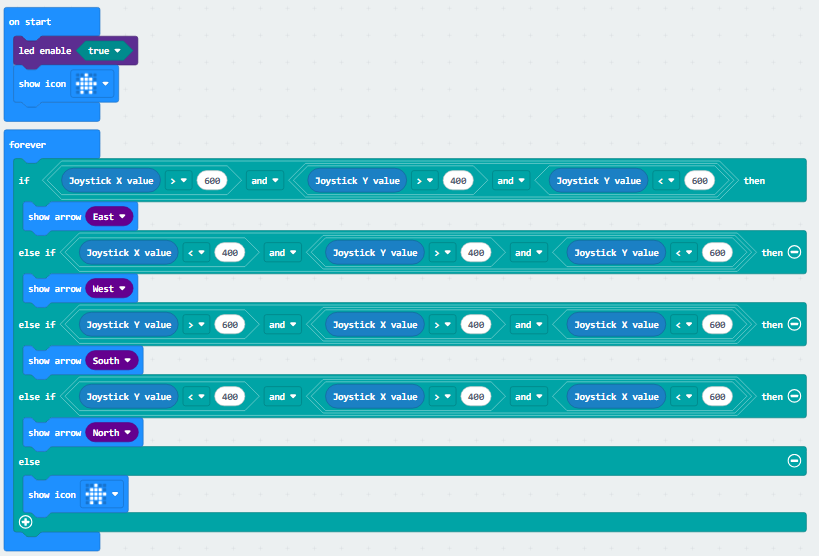
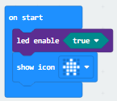
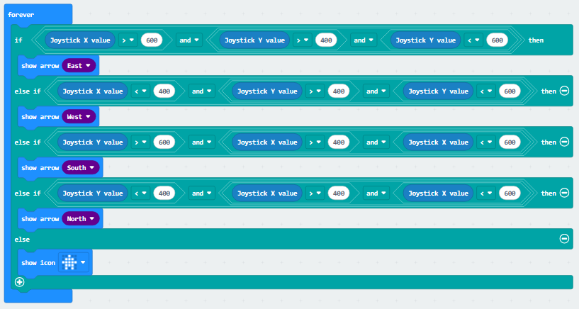

### 4.3.1 方向指示器 

#### 4.3.1.1 简介

当你拨动摇杆时，点阵会实时显示对应方向的箭头：向左拨显左箭头、向右拨显右箭头、向上拨显上箭头、向下拨显下箭头，为你提供清晰的方向参考。

#### 4.3.1.2 元件知识

**micro:bit点阵**

micro:bit主板的LED点阵共由25个发光二极管组成，5个一组，分别对应X和Y方向，形成一个5×5的矩阵，且每个发光二极管是放置在行线（X）和列线（Y）的交叉点上，我们可以通过设置坐标点来实现对25个LED中某一个LED的控制，也可以实现对多个LED的控制。

**手柄摇杆**

| |   |
| :--: | :--: |
| 实物图 | 原理图|

手柄摇杆的内部核心结构由两个阻值为10KΩ的可调电阻（电位器）构成，其方向控制的实现逻辑是：通过单片机的ADC模拟引脚检测推拨的方向（及幅度）输出对应维度的模拟电信号，进而判断拨动方向。在实际的信号读取场景中，当检测到摇杆 X 轴与 Y 轴的模拟数值落在 450~600 这个区间范围内时，即可判定摇杆处于未被主动拨动的中立（静止）状态。

#### 4.3.1.3 所需组件

| |   || 
| :--: | :--: | :--: |
| **micro:bit V2 主板**（自备） ×1 | **micro:bit智能手柄控制板**（已组装） ×1 |**AAA 电池** （自备）x4 |

#### 4.3.1.4 代码流程图

#### 4.3.1.5 实验代码

⚠️ **特别注意：下面示例代码中使用到了手柄的 Makecode 库（前面已介绍导入方法，此处不再赘述），同时摇杆可根据实际情况进行修改以调节其灵敏度。**

**完整代码：**

**简单说明：**

① 初始化LED点阵启用，显示图案

② 读取摇杆X轴与Y轴的值并判断拨动方向，有拨动则显示对应方向的箭头，未拨动则显示。

#### 4.3.1.6 实验结果

烧录程序后将micro:bit主板与组装好的手柄控制板连接（**需要安装电池**），将手柄控制板上的开关拨动到“ON”，当摇杆拨动是会显示指向对应方向的箭头，未拨动时则显示房子的图案。

（**特别提示：** 如果未看到实验现象，请用手按下micro:bit主板上背面的复位按钮，）

