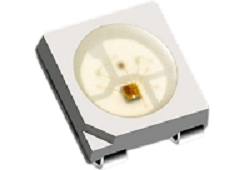
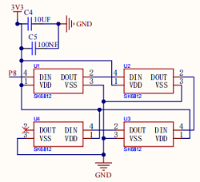
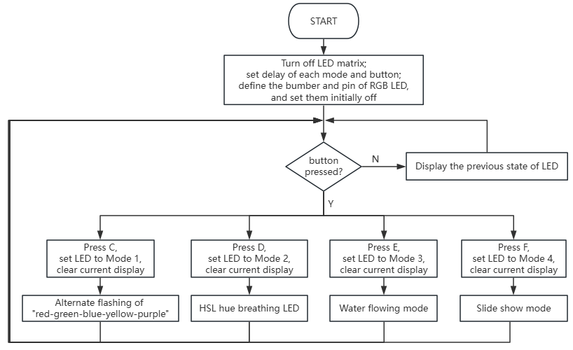
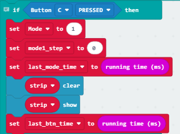
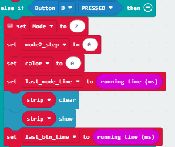
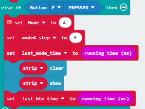
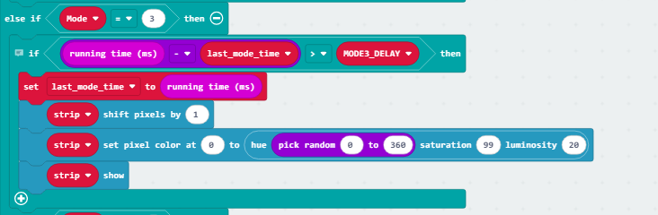
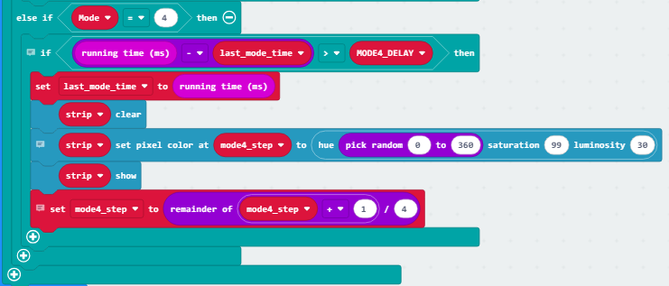

### 4.3.2 七彩灯

#### 4.3.2.1 简介

RGB LED是一种通过红、绿、蓝三原色混合光线实现成像的LED光源。其原理为利用三色光交集形成不同色彩，常见实现方式包括直接三原色混光、蓝光LED配合黄色荧光粉以及紫外LED结合RGB荧光粉。与直接呈现白光的LED相比，RGB LED因独立控制三原色而具备更广的混色范围。

按下 C 键时，彩灯按照 “红 - 绿 - 蓝 - 黄 - 紫” 的顺序交替闪烁；按下 D 键时，彩灯切换至呼吸灯模式；按下 E 键时，彩灯切换至流水灯模式；按下 F 键时，彩灯切换至跑马灯模式；而节日装饰用的彩色灯笼串、圣诞树彩灯，日常氛围营造用的 RGB 灯带、桌面氛围灯，以及游乐园设施、商场招牌上的 LED 装饰灯，都是生活中具备这类多模式切换功能的常见彩灯实例。

#### 4.3.2.2 元件知识

**SK6812 RGB彩灯**

| | |
| :--: | :--: |
| 实物图 | 控制板原理图 |

SK6812 是一款集成了控制电路与发光电路的智能外控 LED 光源，它的外观和 5x5mm的 顶面发光 LED 灯珠，每个灯珠本身就是一个独立像素点。这个像素点内部集成了多种核心电路：智能数字接口的数据锁存电路、信号整形放大驱动电路、电源稳压电路，还有内置的恒流电路和高精度 RC 振荡器。它的通讯采用单极性归零码协议，像素点上电复位后，会通过 DIN 端口接收控制器发来的数据。先收到的 24bit 数据会被第一个像素点提取并存入内部数据锁存器，剩下的数据则经过内部整形放大后，通过 DOUT 端口转发给下一级联的像素点，每经过一个像素点，传输的信号就会减少 24bit。

在手柄的控制板上，我们配置了四颗 SK6812 型号的 RGB 彩灯，这类彩灯支持 256 级亮度调节的红、绿、蓝三原色通道，可组合呈现 256×256×256 种色彩组合；借助这一特性，手柄能实现交替闪烁、呼吸渐变、跑马流动等多样化的灯光显示效果，让交互反馈更直观生动。

**轻触按键**

| | |
| :--: | :--: |
| 实物图 | 控制板原理图 |

轻触按键又叫按键开关，最早出现在日本，称之为敏感型开关，使用时以满足操作力的条件向开关操作方向施压开关功能闭合接通，当撤销压力时开关即断开，其内部结构是靠金属弹片受力变化来实现通断的。

在手柄的控制板上，我们集成了四颗轻触按键，且每颗按键均独立连接至 micro:bit 主板的一个引脚；当按压按键时，电路会触发相应的低电平信号，进而让 micro:bit 快速响应指令，大幅提升交互的便捷性与精准度。

 

#### 4.3.2.3 所需组件

| |   | | 
| :--: | :--: | :--: |
| **micro:bit V2 主板**（自备） ×1 | **micro:bit智能手柄控制板**（已组装） ×1 |**AAA 电池** （自备）x4 |

#### 4.3.2.4 代码流程图

#### 4.3.2.5 实验代码

⚠️ **特别注意：下面示例代码中，MODE\*_DELAY的延时时间值是可以根据实际情况加以修改的。**

**完整代码：**

**简单说明：**

① 在程序启动时执行：先默认关闭 LED 使能（led enable设为 false），接着分别定义了 4 种 LED 模式的动画延迟时间（比如模式 2 延迟设为 5、模式 1 为 500）、按键防抖时长（20）；然后初始化了引脚 P8 上的 4 颗 RGB 格式的 LED 灯，并将灯带初始显示为 “无颜色（色相、饱和度、亮度均为 0）” 的熄灭状态，为后续模式控制做好基础准备。

② 在程序循环中通过判断当前运行时间与上次按键时间的差值是否大于预设防抖时长（BTN_DEBOUNCE），实现按键操作的防抖处理，避免因物理抖动导致按键重复触发。

③ 按下 C/D/E/F 键时，会把模式设为 1-4，同时重置对应模式的动画步骤、计时起点，清空彩灯并刷新，再更新按键时间戳，以此实现不同 LED 显示模式的精准切换与初始运行。

| ||
| :--: | :--: |
|C键被按下|D键被按下|
|     |        |
|E键被按下|F键被按下|

④ 当模式为 1 且当前时间与上次模式时间的间隔超过 MODE1_DELAY 时，先更新模式时间戳，再根据 model_step 的不同值（0-4）让灯带依次显示红、绿、蓝、黄、紫色，刷新显示后通过取余运算将 model_step 循环重置，实现这五种颜色的定时切换效果。

⑤ 当模式为 2 且当前时间与上次模式时间的间隔超过 MODE2_DELAY 时，先更新模式时间戳，再通过取余运算让 color 值（色相）循环递增（范围 0-359），随后清空灯带并显示对应色相、高饱和度（99）、低亮度（20）的颜色，最终实现彩灯的平滑渐变效果。（代码中的亮度和饱和度可以根据实际需求进行相应的调整）

⑥ 当模式为 3 且当前时间与上次模式时间的间隔超过 MODE3_DELAY 时，先更新模式时间戳，接着让灯带像素整体移位 1 位，再给第 0 个像素设置随机色相（0-359）、高饱和度（99）、低亮度（20）的颜色，最后刷新显示，实现像素依次流动且新像素随机变色的流水灯效果。（代码中的亮度和饱和度可以根据实际需求进行相应的调整）

⑦ 当模式为 4 且当前时间与上次模式时间的间隔超过 MODE4_DELAY 时，先更新模式时间戳，接着清空灯带，给model_step对应的像素设置随机色相（0-359）、高饱和度（99）、低亮度（20）的颜色并刷新显示，最后通过取余运算让model_step在 0-3 之间循环，实现单个像素依次点亮且颜色随机的循环效果。（代码中的亮度和饱和度可以根据实际需求进行相应的调整）

#### 4.3.2.6 实验结果

烧录程序后将micro:bit主板与组装好的手柄控制板连接（**需要安装电池**），将手柄控制板上的开关拨动到“ON”，当按下**C键**时，彩灯会以 **红-绿-蓝-黄-紫**的顺序交替闪烁；当按下**D键**时，彩灯会的色相会循环递增，最终实现彩灯循环渐变的效果；当按下**E键**时，彩灯从第0个像素开始产生一个随机颜色，随后逐次移位一个，最终实现彩色流水灯的效果；当按下**F键**时，彩灯会产生一个随机颜色，依次单个点亮每个像素，最终实现单个像素依次点亮且颜色随机的循环效果。

（**特别提示：** 如果未看到实验现象，请用手按下micro:bit主板上背面的复位按钮，）

