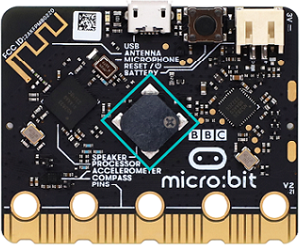
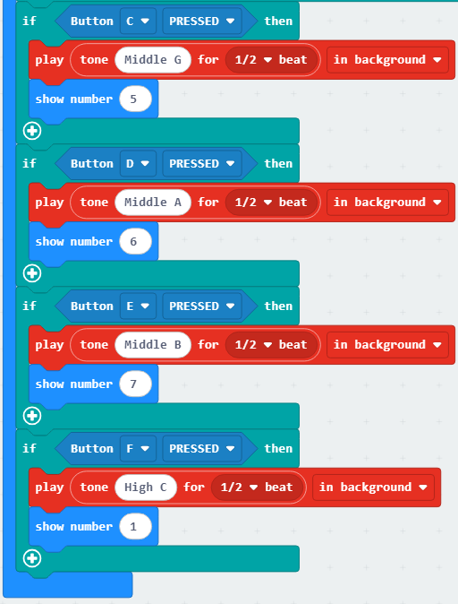

### 4.2.3 简易电子琴

#### 4.2.3.1 简介

通过操控 JoyBit 扩展模块的摇杆与按键，即可控制 micro:bit 的蜂鸣器播放不同音阶的乐符，同时 LED 点阵屏会同步显示对应数字标识：向右拨动摇杆时发出 “Do（中央 C 调）” 并显示 “1”，向左拨动发出 “Re（D 调）” 并显示 “2”，向上拨动发出 “Mi（E 调）” 并显示 “3”，向下拨动发出 “Fa（F 调）” 并显示 “4”；按下 C 键发出 “Sol（G 调）” 并显示 “5”，按下 D 键发出 “La（A 调）” 并显示 “6”，按下 E 键发出 “Si（B 调）” 并显示 “7”，按下 F 键则发出高八度的 “Do” 并再次显示 “1”，整体实现了摇杆、按键与音阶、数字显示的精准联动。

#### 4.2.3.2 元件知识

**Microbit扬声器**

micro:bit主板有内置扬声器，这使得添加声音变得非常容易。你可以用扬声器发出咯咯笑、问候你、打哈欠或悲伤等等，还可以编写一首歌曲，你的micro:bit主板可以通过编程制作各种各样的声音——从单个音符、音调和节拍到你自己的音乐作品，例如：歌曲《小星星》，让扬声器播放出来。

#### 4.2.3.3 所需组件

| |   | | 
| :--: | :--: | :--: |
| **micro:bit V2 主板**（自备） ×1 | **micro:bit智能手柄控制板**（已组装） ×1 |**AAA 电池** （自备）x4 |

#### 4.2.3.4 代码流程图

#### 4.2.3.5 实验代码

⚠️ **特别注意：下面示例代码中，摇杆的可以根据实际情况加以修改的，从而对其灵敏度进行调节。**

**完整代码：**

**简单说明：**

① 初始化micro:bit LED点阵使能开启，LED点阵显示。

② 判断摇杆拨动的方向，在后台播放对应的音阶乐符半拍，LED点阵显示对应音阶乐符的数字。

③ 判断是否有按键按下，在后台播放对应的音阶乐符半拍，LED点阵显示对应音阶乐符的数字。

#### 4.2.3.6 实验结果

烧录程序后将micro:bit主板与组装好的手柄控制板连接（**需要安装电池**），将手柄控制板上的开关拨动到“ON”，LED点阵首先会显示“”，当摇杆向右拨动摇杆时发出 “Do（中央 C 调）” 并显示 “1”，向左拨动发出 “Re（D 调）” 并显示 “2”，向上拨动发出 “Mi（E 调）” 并显示 “3”，向下拨动发出 “Fa（F 调）” 并显示 “4”；按下 C 键发出 “Sol（G 调）” 并显示 “5”，按下 D 键发出 “La（A 调）” 并显示 “6”，按下 E 键发出 “Si（B 调）” 并显示 “7”，按下 F 键则发出高八度的 “Do” 并再次显示 “1”，最终实现简易电子琴的效果。

（**特别提示：** 如果未看到实验现象，请用手按下micro:bit主板上背面的复位按钮，）

