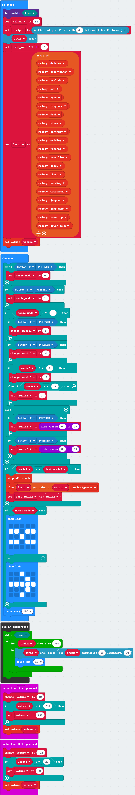
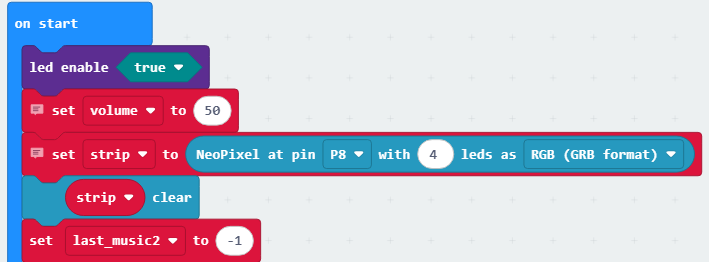
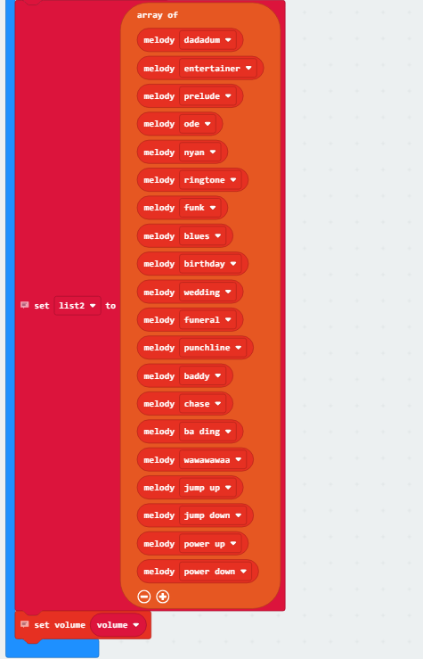
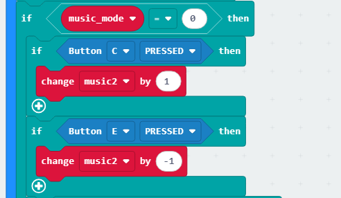
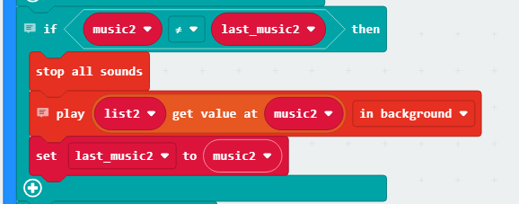
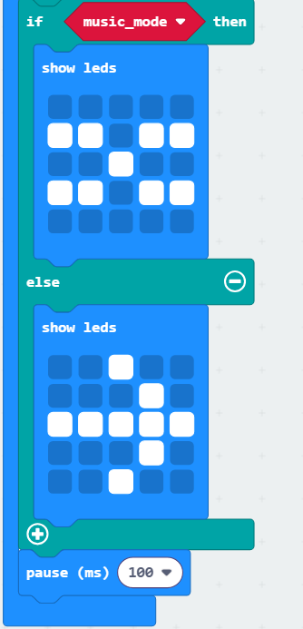
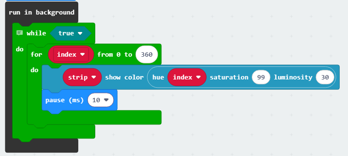

### 4.2.4 音乐播放器

#### 4.2.4.1 简介

音乐播放器是通过micro：bit主板板载蜂鸣器实现发声（不可播放人声音乐），内置 20 首简短音乐，支持顺序播放和随机播放两种模式：顺序模式下，按下 “上一首（C键）” 或 “下一首（E键）” 按键会按照预设顺序表切换曲目，播放至列表末尾后停止；随机模式下，每次按下切换按键会从 20 首铃声中随机选取一首播放，单首播放完毕后即停止，且播放期间彩灯会同步闪烁，micro:bit 的 LED 点阵屏还会实时显示当前的播放模式。 

#### 4.2.4.2 所需组件

| |   | | 
| :--: | :--: | :--: |
| **micro:bit V2 主板**（自备） ×1 | **micro:bit智能手柄控制板**（已组装） ×1 |**AAA 电池** （自备）x4 |

#### 4.2.4.3 代码流程图

#### 4.2.4.4 实验代码

**完整代码：**

**简单说明：**

① 初始化LED点阵使能开启，初始化音量变量，初始化RGB彩灯为引脚'P8'，数量为4个；

② 初始化音乐数组为20首并设置其内容，设置初始音量。

③ 判断D键或F键是否被按下，按下D键音乐模式设为'0-顺序模式'，按下F键音乐模式设为'1-随机模式'；

④ 当处于顺序模式时，按下C键按照音乐数组的顺序播放上一首，按下D键按照音乐数组的顺序播放下一首；

由于音乐数组中只有20首音乐，在顺序模式下只能播放第0-19的序号的音乐，所以用过判断限制防止数组溢出；

当处于随机模式时，按下C键或E键时都会随机切换一首音乐；

⑤ 判断上一首音乐是否与当前播放的音乐不一致，不一致就先停止播放再播放当前音乐；

⑥ 判断当前模式，'0-顺序模式'时显示'','1-随机模式'时显示''随后延时100ms;

⑦ 在后台执行RGB彩灯呼吸闪烁的效果；

⑧ 按下A键时音量+10，按下B键时音量-10，micro:bit蜂鸣器的音量是根据内部与蜂鸣器所连接的引脚输出电压有关，通过DAC将0~255的数字量量化成模拟量就可以可控制声音的大小；

#### 4.2.4.5 实验结果

烧录程序后将micro:bit主板与组装好的手柄控制板连接（**需要安装电池**），将手柄控制板上的开关拨动到“ON”，设备开机后默认处于顺序模式，会自动播放音乐列表中索引为 “0” 号位置的音乐，单首播放完毕后即停止，此时按下 C 键可播放上一首音乐、按下 E 键可播放下一首音乐，按下 F 键可切换至随机模式，按下 D 键则可切换回顺序模式；在随机模式下，按下 C 键或 E 键都会从 20 首音乐中随机选取一首进行播放，单首播放完毕后即停止；设备开机后 RGB 彩灯会持续以彩色呼吸灯的效果闪烁，同时 micro:bit 的 LED 点阵在顺序模式下显示图案 “”、在随机模式下显示图案 “”，此外按下 A 键可增大音量、按下 B 键可减小音量，通过以上操作即可实现本实验的最终效果。

（**特别提示：** 如果未看到实验现象，请用手按下micro:bit主板上背面的复位按钮，）

