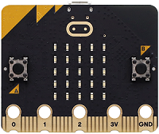
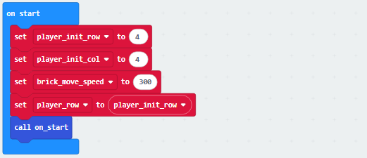
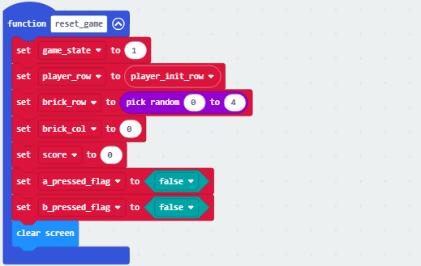
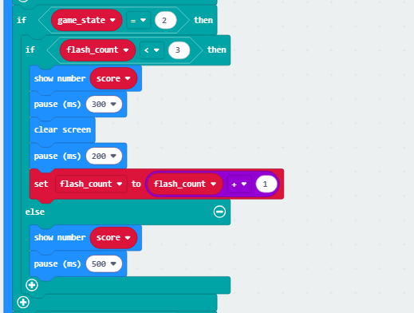
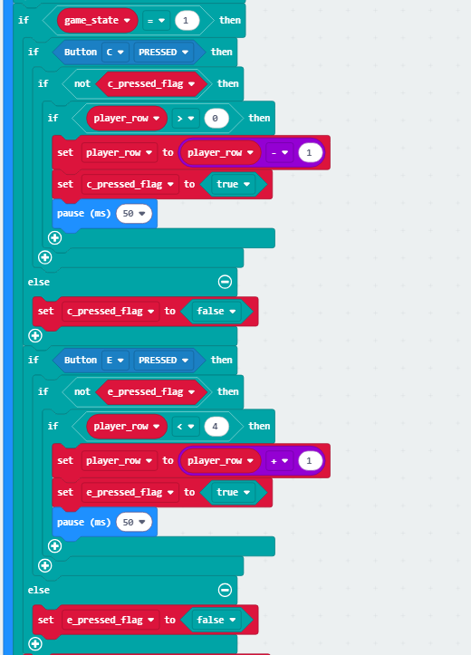
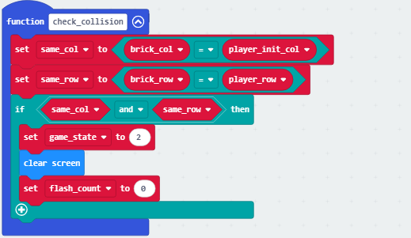
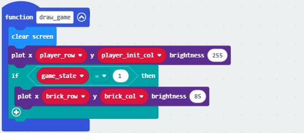

### 4.3.5 躲避砖块

#### 4.3.5.1 简介

本实验是做了一个躲避砖块的游戏，玩家通过micro:bit手柄控制代表玩家的LED灯左右移动，躲避从上方侧不断向下移动的砖块障碍物。游戏包含三个状态：未开始时的动态图标展示、运行中的实时躲避操作以及碰撞后的得分显示。玩家每成功躲避一个砖块（砖块移动到最下方边界）可获得1分，当光标与砖块在同一位置相撞时游戏结束，系统会以滚动效果显示最终得分。游戏支持通过A+B组合键进行开始与重置操作，整个游戏机制简洁明了，结合了实时反应与策略预判的玩法体验。

#### 4.3.5.2 所需组件

| |   | | 
| :--: | :--: | :--: |
| **micro:bit V2 主板**（自备） ×1 | **micro:bit智能手柄控制板**（已组装） ×1 |**AAA 电池**（自备） x4 |

#### 4.3.5.3 代码流程图

#### 4.3.5.4 实验代码

⚠️ **特别注意：下面示例代码中，初始化的阈值300可以根据实际情况加以修改的，数字越大砖块下落越慢，数字越小砖块下落越块**

**完整代码：**

**简单说明：**

① 初始化相应变量，分别是玩家初始行，玩家初始列，砖块移动速度，并将玩家所处行设置为玩家初始行，调用on_start函数；

② 这个函数的功能是，在游戏开始时将砖块的列数设置为0~4中的随机一列；

③ 先判断 “A+B 按键按下且游戏非运行状态” 是否满足（即 “能否启动”），若满足且启动标记为初始状态，会先标记启动状态、短暂延迟后再次确认按键是否仍按下 —— 是则触发游戏重置（调用reset_game函数）并记录时间，否则取消启动标记；

④ 这个函数的功能是将游戏恢复到初始状态：执行时会把游戏状态设为 “运行中”（game_state=1），把玩家位置重置到初始行，随机设定砖块的行（0 到 4 之间）、列设为 0，分数清零，同时把 A/B 键的按下标记设为未触发，最后清空屏幕；

⑤ 当游戏状态为**0-初始状态**（手柄开机后未进行游戏的状态），是则以图标闪烁状态显示动画；

⑥ 当游戏状态为**2-游戏结束**时，会根据闪烁计数flash_count控制分数的显示效果 —— 若计数小于 3，就重复 “显示分数→短暂停→清屏→短暂停→计数加 1” 的快速闪烁流程；当计数达到 3 后，则只持续显示分数并延长暂停时间；

⑦ 当游戏状态为**1-游戏中**时，按下 C 键且未触发过按压标记、同时玩家行号大于 0，就会让玩家行号减 1 并标记 C 键已触发（配合延迟防抖）；按下 E 键且未触发过按压标记、同时玩家行号小于 4，就会让玩家行号加 1 并标记 E 键已触发（同样延迟防抖），无操作时则重置对应按键的触发标记；

⑧ 首先计算当前时间与上次砖块移动时间的差值，当差值超过砖块移动速度阈值时，更新砖块移动时间并让砖块列号加 1；若砖块列号超过 4（到达边界），则将砖块随机重置到新行、列号归零，同时分数加 1；最后调用碰撞检测与游戏画面绘制的函数，实现砖块的自动推进、边界重置、得分累计，以及游戏状态的实时更新；

⑨ 这个函数的功能是判断游戏是否结束：首先分别判断 “砖块列号是否与玩家初始列号一致”“砖块行号是否与玩家当前行号一致”，若两者同时满足（即砖块与玩家位置重叠），则将游戏状态设为 2（结束状态），清空屏幕并重置闪烁计数，以此实现 “砖块与玩家碰撞则游戏结束” 的判定逻辑；

⑩ 这个函数的功能是绘制游戏画面：首先清空屏幕，然后在玩家初始列、当前行的位置绘制亮度为 255 的点（代表玩家）；若游戏处于运行状态（game_state=1），则在砖块行、列的位置绘制亮度为 85 的点（代表砖块），通过亮度的强弱来区分砖块和玩家

#### 4.3.5.5 实验结果

烧录程序后将micro:bit主板与组装好的手柄控制板连接（**需要安装电池**），将手柄控制板上的开关拨动到“ON”，此时会以“”进行闪烁，此时便是处于**0-初始状态**，当同时按下A键和B键时（为防止误触需要按下1秒左右）会切换到游戏开始状态，此时便是处于**1-游戏中**，砖块会随机从一列落下，玩家可以通过按C键进行左移，E键进行右移，当玩家每躲避一个砖块便得分+1，否则游戏结束，进入游戏结束状态；此时便是处于**2-游戏结束**，此时会显示玩家得分，当再次同时按下A键和B键时，便开启新一轮游戏，知道玩家关闭电源（将手柄上的开关拨动到“OFF”）。

（**特别提示：** 如果未看到实验现象，请用手按下micro:bit主板上背面的复位按钮，）

