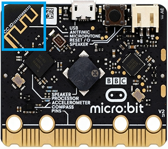
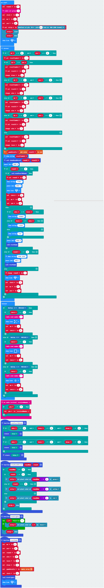
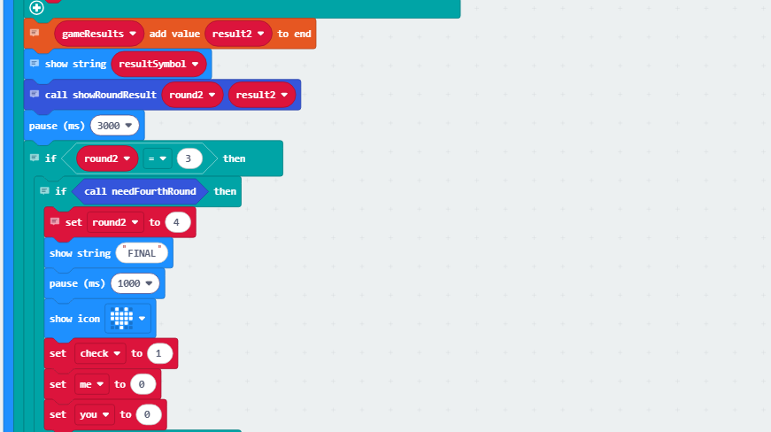
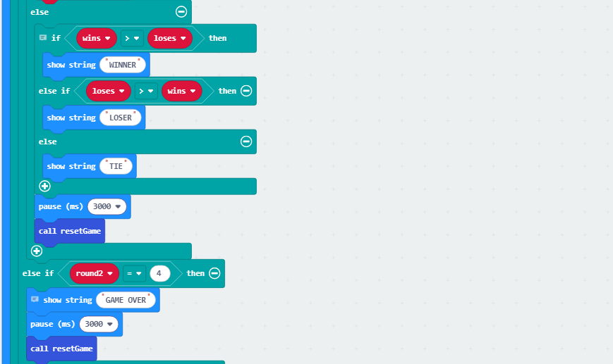
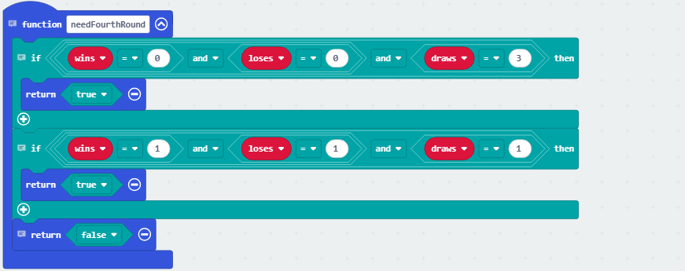
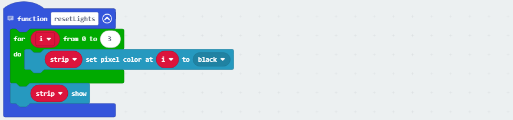

### 4.2.6 猜拳游戏

#### 4.2.6.1 简介

本实验基于 micro:bit 做了一个双人无线对战石头剪刀布游戏，玩家通过 手柄上的按键选择石头 / 剪刀 / 布出拳，两台设备借助无线电通信完成对战数据互通。游戏采用 3 局制规则，前三局结束后若出现三局全平或一胜一负一平的情况，将触发第四局加赛；每局胜负通过 micro:bit 屏幕符号（W 胜 / L 负 /= 平）和 P8 引脚的 RGB彩灯（绿胜 / 红负 / 黄平）可视化反馈，整轮游戏结束后系统自动重置数据与彩灯，等待下一轮对战，整体玩法结合了无线交互与多局制对战的趣味体验。

#### 4.2.6.2 元件知识

**Microbit 无线电**

micro:bit主板有内置 **2.4GHz 射频（Radio）和低功耗蓝牙（BLE）** 两种便捷的无线通信功能，2.4GHz射频和低功耗蓝牙不能同时使用。其中，2.4GHz 射频通信无需配对，支持设置 255 个独立分组避免干扰，通信距离可达 10–30 米，能快速传输数字、字符串等数据，低功耗蓝牙则主要用于与手机、平板等智能设备配对，可实现传感器数据上传、手机 APP 遥控等物联网场景应用，为 micro:bit 的创意开发拓展了更多可能性。

#### 4.2.6.3 所需组件

| |   | | 
| :--: | :--: | :--: |
| **micro:bit V2 主板**（自备） ×2 | **micro:bit智能手柄控制板**（已组装） ×2 |**AAA 电池** （自备）x8 |

#### 4.2.6.4 代码流程图

#### 4.2.6.5 实验代码

**完整代码：**

**简单说明：**

① 初始化无线电并设置组为'1',初始化猜拳局数、状态、对手和自身的猜拳结果，初始化RGB彩灯在P8引脚上4颗RGB彩灯并刷新显示，点阵显示图案

② 判断当前所在局数的猜拳胜负，如果自身猜拳选择和对手选择一致则为平局(**1/2/3 分别代表 剪刀/石头/布)**，如果不一致则判断胜负结果(**剪刀胜布,布胜石头,石头胜剪刀**)，将局数加一，存储对局结果。

③ 将对局结果存入数组中，显示对局结果对应的字符串，如果当前对局是第3局，就判断是否需要进行第4局（**三局都为平局，一平一败一胜**）是的话就显示"FINAL",等待1秒之后清除猜拳选择。

否则如果不需要进行第四局便显示当前轮数的结果，胜利显示"WINNER",失败显示"LOSER",平局显示"TIE",等待3秒后调用resetGame函数，清除复位游戏所有变量，如果对局是四局则显示"GAME OVER",等待3秒后调用resetGame函数，清除复位游戏所有变量。

否则游戏没有结束则显示图案，然后清除自身和对手的猜拳选择。

④ 当按下C键时，无线电发送数字"1"代表剪刀，点阵显示图标;当按下D键时，无线电发送数字"3"代表布，点阵显示图标；当按下E键时，无线电发送数字"2"代表石头，点阵显示图标

⑤ 接收无线电的数据（即对手的选择）。

⑥ 这个函数时用来判断是否需要进行第四局，当三局都是平局或一胜一败一平时，则需要进行第四局，否则不需要进行第四局。

⑦ 这个函数是用于根据对局结果控制对应局数的RGB灯显示对应的对局结果颜色，胜利显示绿色，失败显示红色，平局显示黄色。

⑧ 这个函数是用于当游戏结束时，清除四个RGB灯的显示。

⑨ 这个函数是用于复位游戏状态，清除所有游戏变量的值，复位RGB灯的显示，点阵显示

#### 4.2.6.6 实验结果

烧录程序后将micro:bit主板与组装好的手柄控制板连接（**需要安装电池**），将手柄控制板上的开关拨动到“ON”，此时点阵会显示图标，玩家通过 手柄上的按键选择剪刀（C键）/ 石头（E键）/ 布（D键）出拳，当按下按键做出选择便会显示对应图标，两台设备借助无线电通信完成对战数据互通，随后进行当前对局的胜负判断，胜利显示"W"RGB亮绿灯，平局显示"="RGB亮黄灯，失败显示"L"RGB亮红灯（当前是第几局便会亮起第几个RGB灯），若游戏未结束随后便开启下一局。游戏采用 3 局制规则，前三局结束后若出现三局全平或一胜一负一平的情况，将触发第四局加赛；当前三局已经出现胜负，则胜利会显示"WINNER",失败会显示"LOSER",显示完成之后便显示"GAME OVER"重置游戏，如果第四局也未决出胜负则也会触发游戏结束。

（**特别提示：**每局游戏需等待显示爱心图案后才能继续下一局，如果未看到实验现象，请用手按下micro:bit主板上背面的复位按钮）

