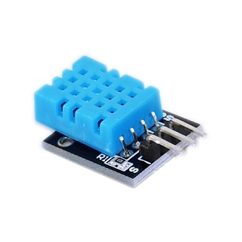
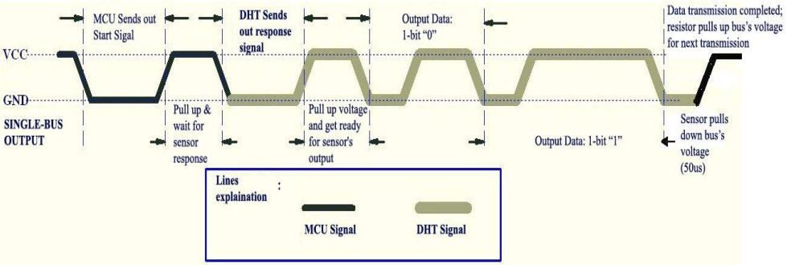
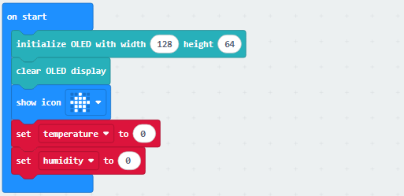
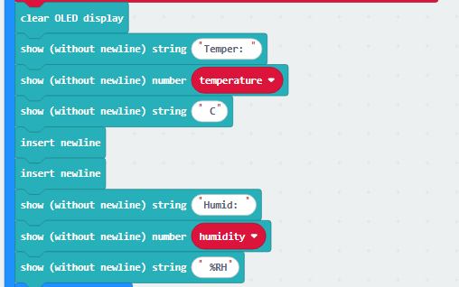
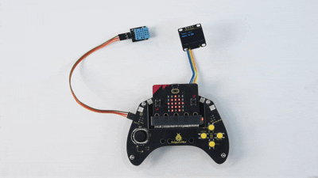

### 4.3.7 简易温湿度计

#### 4.3.7.1 简介

本教程介绍如何使用Micro:bit主板、手柄控制板、XHT11温湿度传感器和OLED显示屏，构建一个温湿度检测系统。该系统的XHT11温湿度传感器能够测量环境中的温度和湿度，同时，OLED显示屏会实时刷新并显示当前温度、湿度数据，手柄控制板可辅助实现电路扩展与稳定连接，从而达到实现简易温度计的功能效果。

#### 4.3.7.2 元件知识

**XHT11温湿度传感器**

XHT11温湿度传感器是一种数字信号输出的温湿度传感器。它利用特殊的模拟信号采集、转换技术和温度、温湿度传感技术，确保传感器拥有良好的长时间稳定性，和较高的可靠性。该传感器内部包含高精度的电阻式湿度传感器件，和电阻式热敏测温传感器件，并与一个8位的性能高的单片机相连接。

**XHT11通信方式：**

XHT11 器件采用简化的单总线通信。单总线即只有一根数据线，系统中的数据交换、控制均由单总线完成。

- 单总线传送数据位定义：

  - 单总线数据格式：一次传送 40 位数据，高位先出。

  - 8bit 湿度整数数据 + 8bit 湿度小数数据 + 8bit 温度整数数据 + 8bit 温度小数数据 + 8bit 校验位。**注：其中湿度小数部分为 0**。

- 校验位数据定义：
  
  - 8bit 湿度整数数据 + 8bit 湿度小数数据 + 8bit 温度整数数据 + 8bit 温度小数数据。8bit 校验位等于所得结果的末 8 位。

数据时序图如下：

用户主机（MCU）发送一次开始信号后，XHT11 从低功耗模式转换到高速模式，待主机开始信号结束后，XHT11 发送响应信号，送出 40bit 的数据，并触发一次信采集。信号发送如图所示:

⚠️ **注意:** 主机从 XHT11 读取的温湿度数据总是前一次的测量值，如两次测间隔时间很长，请连续读两次以第二次获得的值为实时温湿度值。

**原理图：**

**参数：**

- 工作电压: DC 3.3V~5V 
- 工作电流: (Max)2.5mA@5V
- 最大功率: 0.0125W
- 温度范围: -25 ~ +60°C (±2℃)
- 湿度范围: 5 ~ 95%RH（25C°左右精度为±5%RH）
- 输出信号: 数字双向单总线

**OLED显示屏**

OLED技术可以提供丰富的色彩表现、高对比度、广视角等优点。画面清晰生动，黑色表现尤其出色。OLED屏幕每个像素自发光，无需背光源，功耗相对较低。0.9寸OLED屏幕凭借其小尺寸、高分辨率(128*96像素)、低功耗等特点，非常适合嵌入式及可穿戴设备领域的应用。

⚠️ **特别提醒：** 我们这款OLED显示屏的SDA接口是接到Micro:bit主板上的引脚P20，SCL接口接到Micro:bit主板上的引脚P19。

**模块参数：**

- 工作电压：DC 3.3V-5V
- 工作电流：30mA
- 接口：间距为2.54mm的排针接口
- 通信方式：I2C通信
- 内部驱动芯片：SSD1306
- 分辨率：128×64
- 可视角度：大于150°

#### 4.3.7.3 所需组件

| |   | | 
| :--: | :--: | :--: |
| **micro:bit V2 主板**（自备） ×1 | **micro:bit智能手柄控制板**（已组装） ×1 |**AAA 电池** （自备）x4 |
||||
|**XHT11温湿度传感器** （自备）×1|**OLED显示屏** （自备）×1 |**母对母杜邦线**（自备） x7|

#### 4.3.7.4 接线图

| OLED显示屏 | micro:bit手柄控制板 |micro:bit主板引脚 |
| :--: | :--: | :--: | :--: |
| GND |  GND | GND |
| VCC |  3V | 3V |
| SDA |  SDA | P20 |
| SCL |  SCL | P19 |

| XHT11温湿度传感器 | micro:bit手柄控制板 |micro:bit主板引脚 |
| :--: | :--: | :--: |
| G | GND | GND |
| V |  3V | 3V |
| S |  12 | P12 |

#### 4.3.7.5 代码流程图

#### 4.3.7.6 实验代码
⚠️ **特别注意：在本课程中由于使用到了OLED与DHT11，所以需要额外导入以下库：https://github.com/keyestudio/pxt-environment-kit-master**

**完整代码：**

**简单说明：**

① 初始化OLED显示屏的像素，OLED清屏，Microbit主板上的5×5LED点阵屏显示图案，定义两个变量temperature与humidity的初始值均为0 。

② 将XHT11温湿度传感器读取的温度值赋给于变量temperature，湿度值赋给于变量humidity。

③ OLED显示屏显示XHT11温湿度传感器检测到的温度和湿度。

④ 延时500ms(即：0.5s)。

#### 4.3.7.7 实验结果

烧录程序后将micro:bit主板与组装好的手柄控制板连接（**需要安装电池**），将手柄控制板上的开关拨动到“ON”，将示例代码传成功下载到micro:bit主板后，OLED显示屏实时显示XHT11温湿度传感器检测到的当前温度和湿度。

（**特别提示：** 如果未看到实验现象，请用手按下micro:bit主板上背面的复位按钮，）

