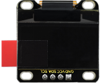
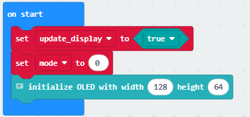
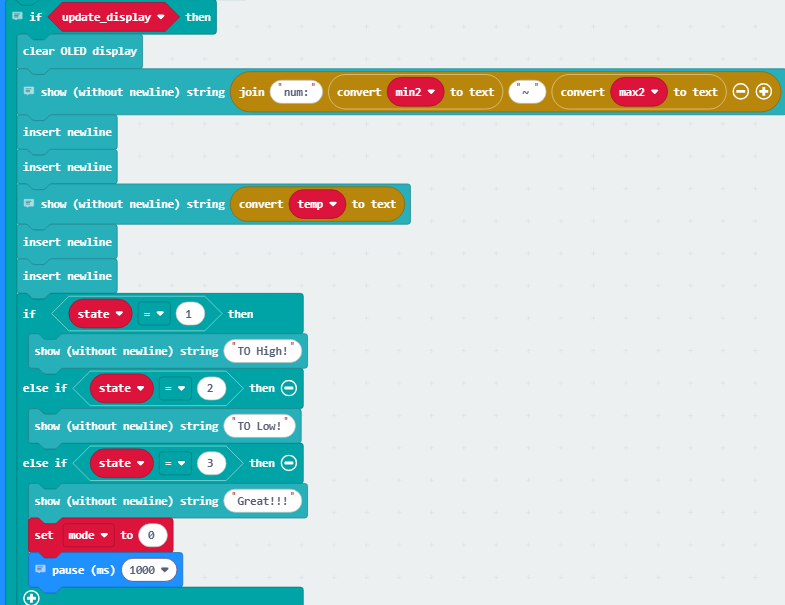
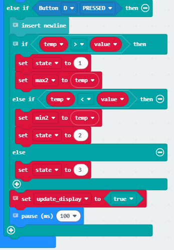

### 4.2.8 猜数字

#### 4.2.8.1 简介

在本项目教程中，将介绍如何使用Micro:bit主板、手柄控制板、OLED显示屏制作一个猜数字的游戏。当猜对了数字会在OLE显示D屏显示“Great!!!”，当猜的数字过大或者过小便会分别显示“To High!”或“To Low!”同时也会显示所猜数字的范围。

#### 4.2.8.3 所需组件

| |   | | 
| :--: | :--: | :--: |
| **micro:bit V2 主板**（自备） ×1 | **micro:bit智能手柄控制板**（已组装） ×1 |**AAA 电池** （自备）x4 |
|||
|**OLED显示屏** （自备）×1 |**母对母杜邦线**（自备） x4|

#### 4.2.8.4 接线图

| OLED显示屏 | micro:bit手柄控制板 |micro:bit主板引脚 |
| :--: | :--: | :--: |
| GND |  GND | GND |
| VCC |  3V | 3V |
| SDA |  SDA | P20 |
| SCL |  SCL | P19 |

#### 4.2.8.5 代码流程图

#### 4.2.8.6 实验代码

⚠️ **特别注意：在本课程中由于使用到了OLED，所以需要额外导入以下库：https://github.com/keyestudio/pxt-environment-kit-master**

**完整代码：**

**简单说明：**

① 初始化屏幕更新标志位，模式变量为0（0-游戏准备状态，1-游戏运行状态），初始化OLED屏幕显示。

② 当处于游戏准备状态时，设置猜测值范围、初始猜测值、目标值、猜测

③ 在OLED显示屏上更新猜测值范围以及猜测值，如果结果状态标志位发生变化便显示进行相应提示，当state=1时显示“TO High!”；当state=2时显示“TO LOW!”；当state=1时显示“Great!!!”，同时将模式设置为游戏准备状态并等待1000毫秒（即一秒）。

④ 当C键被按下时，使猜测值temp的值加1，当猜测值大于范围最大值时，便将猜测值设为范围最大值（为了防止猜测值超出范围）；当E键被按下时，使猜测值temp的值减1，当猜测值小于范围最小值时，便将猜测值设为范围最小值（为了防止猜测值超出范围）；

⑤ 如果是D键按下，便比较猜测值与目标值，如果 temp 更大，就记录新的最大值 max2，并进入状态 1；如果 temp 更小，就记录新的最小值 min2，并进入状态 2；如果两者相等，就进入状态 3。最后更新显示并短暂延时1000毫秒。

#### 4.2.8.7 实验结果

烧录程序后将micro:bit主板与组装好的手柄控制板连接（**需要安装电池**），将手柄控制板上的开关拨动到“ON”，将示例代码传成功下载到micro:bit主板后，OLED 显示屏初始化并显示数值范围 “num: 1 ~ 100” 和初始猜测值 50；玩家可通过按 C 键使当前猜测值 temp 加 1（上限为 100）、按 E 键使 temp 减 1（下限为 1），按键后屏幕会实时更新显示调整后的 temp 值；当按下 D 键提交猜测时，程序会将 temp 与随机生成的目标值 value 对比，若 temp 大于 value，屏幕提示 “To High!” 并更新最大值边界 max2 为当前 temp，若 temp 小于 value 则提示 “To Low!” 并更新最小值边界 min2 为当前 temp，若 temp 等于 value 则提示 “Great!!!”；猜对后屏幕保持 “Great!!!” 提示 1 秒，随后程序自动重置，生成新的随机目标值，回到初始状态开始新一轮猜数游戏，整个过程循环往复。

⚠️ **特别提醒：在实验结果中，动图中的积木块，是不提供的。**

（**特别提示：** 如果未看到实验现象，请用手按下micro:bit主板上背面的复位按钮，）

