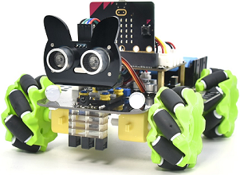
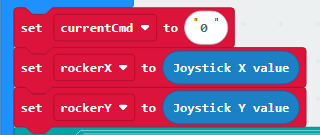
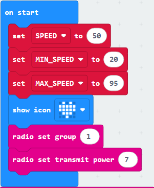

### 4.3.9 基于Micro:bit手柄控制的4WD Mecanum Robot Car

#### 4.3.9.1 简介

本项目基于手柄控制板、Micro:bit 主板与4WD Mecanum Robot Car来实现本实验，通过手柄上的摇杆来控制小车前后左右的移动，通过手柄上的C键控制小车横向向左移动，D键控制小车横向向右移动；E键控制小车加速，D键控制小车减速（速度范围20~95）；当没有任何操作时小车则静止不动。

#### 4.3.9.2 所需组件

| |   | | 
| :--: | :--: | :--: |
| **micro:bit V2 主板**（自备） ×1| **micro:bit智能手柄控制板**（已组装） ×1 |**AAA 电池** （自备）x4 |
|  |  |
| **KS4034套件**（自备） ×1 | **18650电池**（自备） ×2 |

关于4WD Mecanum Robot Car 小车 **(KS4034套件)** 的详细信息请查看：[点击此处](https://docs.keyestudio.com/projects/KS4034/en/latest/)
#### 4.3.9.4 代码流程图
⚠️ **特别注意：在本课程中在编写小车端程序时，需要导入以下库：https://github.com/keyestudio2019/mecanum_robot_v2**

**手柄端流程图**

**小车端流程图**

#### 4.3.9.5 实验代码

**手柄端完整代码：**

**简单说明：**

① 初始化无线电组为1，信号发射强度为7；显示心形图标，初始化变量SEND_INTERCAL为100、BTN_DEBOUNCE_TIME为20.

② 将变量currentCmd（指令内容变量）设为字符‘0’，同时分别把摇杆的 X 轴、Y 轴数值赋值给rockerX和rockerY变量。

③ 判断摇杆或按键是否有相应的操作，有操作则设置变量currentCmd（指令内容变量）为对应字符（R/U/L/D/A/B/Z/X）,无操作则不变。

④ 判断变量currentCmd（指令内容变量）与变量lastCmd(记录上一次指令内容)是否不同，不同则发送currentCmd，并将lastCmd设置为currentCmd，然后延时等待一段时间。

**小车端完整代码**

**简单说明：**

① 初始化无线电组为1，信号发射强度为7；显示心形图标，初始化变量SPEED为50、MIN_SPEED为20、MAX_SPEED为95.

② 接收无线电发送的指令值，将指令存储在变量item。

③ 根据变量item接收的字符指令（U/L/D/R/A/B），分别调用对应的函数控制小车完成前进、左转、后退、右转、左移、右移等不同运动动作。

④ 根据变量item接收的字符指令（Z/X），分别对小车进行加速或减速，加速时将速度设置为SPEED+5与MAX_SPEED中的最小值（防止速度大于MAX_SPEED），减速时将速度设置为SPEED-5与MIN_SPEED中的最大值（防止速度小于MIN_SPEED），

⑤ 定义了六个小车运动控制函数：car_back 控制四个电机全部向后转动实现后退；car_forward 控制四个电机全部向前转动实现前进；car_left 通过左半部分电机向后、右半部分电机向前转动实现左转；car_right 通过右半部分电机向后、左半部分电机向前转动实现右转；car_left_move 和 car_right_move 则通过对角电机的配合转动实现左移和右移，所有函数均以变量 SPEED 作为电机转速。

#### 4.3.9.6 实验结果

将小车与手柄的Micro:bit 主板分别烧录小车端和手柄端的程序，并分别安装好电量充足的电池，将烧录手柄端程序的Micro:bit 主板与手柄连接，将烧录小车端程序的Micro:bit 主板与小车连接；分别拨动小车与手柄上的开关到“ON”；此时可以通过拨动手柄上的摇杆控制小车运动，向上拨动小车前进，向下拨动小车后退，向左拨动小车左转，向右拨动小车右转；通过手柄手柄上的按键控制小车加减速度和横向左右移动，C键控制小车横向向左移动，D键控制小车横向向右移动；E键控制小车加速，D键控制小车减速（速度范围20~95）。

（**特别提示：** 如果未看到实验现象，请用手按下micro:bit主板上背面的复位按钮，）

