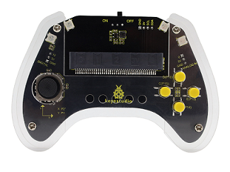

### 5.3.1 方向指示器  

#### 5.3.1.1 简介


当你拨动摇杆时，点阵会实时显示对应方向的箭头：向左拨显左箭头、向右拨显右箭头、向上拨显上箭头、向下拨显下箭头，为你提供清晰的方向参考。 


#### 5.3.1.2 元件知识


**micro:bit点阵**


micro:bit主板的LED点阵共由25个发光二极管组成，5个一组，分别对应X和Y方向，形成一个5×5的矩阵，且每个发光二极管是放置在行线（X）和列线（Y）的交叉点上，我们可以通过设置坐标点来实现对25个LED中某一个LED的控制，也可以实现对多个LED的控制。

**手柄摇杆**

| |   |
| :--: | :--: |
| 实物图 | 原理图|


手柄摇杆的内部核心结构由两个阻值为10KΩ的可调电阻（电位器）构成，其方向控制的实现逻辑是：通过单片机的ADC模拟引脚检测推拨的方向（及幅度）输出对应维度的模拟电信号，进而判断拨动方向。在实际的信号读取场景中，当检测到摇杆 X 轴与 Y 轴的模拟数值落在 450~600 这个区间范围内时，即可判定摇杆处于未被主动拨动的中立（静止）状态。


#### 5.3.1.3 所需组件

| |   || 
| :--: | :--: | :--: |
| **micro:bit V2 主板**（自备） ×1 | **micro:bit智能手柄控制板**（已组装） ×1 |**AAA 电池** （自备）x4 |

#### 5.3.1.4 代码流程图


#### 5.3.1.5 实验代码

**完整代码：**

```Python
# import related libraries
from microbit import *

display.show(Image.HOUSE)

while True:
    #Read the toggle state of the joystick
    x = pin2.read_analog()
    y = pin1.read_analog()
    #Determine the direction in which the joystick is toggled
    if x > 600 and (400 < y < 600):
        display.show(Image.ARROW_E)
    elif x < 400 and (400 < y < 600):
        display.show(Image.ARROW_W)
    elif y > 600 and (400 < x < 600):
        display.show(Image.ARROW_S)
    elif y < 400 and (400 < x < 600):
        display.show(Image.ARROW_N)
    else:
        display.show(Image.HOUSE)
```


**简单说明：**

① 导入库并显示初始图像。
这段代码首先导入了 `microbit` 库，这是 MicroPython 在 Micro:bit 上运行所必需的核心库，它提供了访问 Micro:bit 硬件（如 LED 显示屏、引脚等）的所有功能。导入后，程序立即在 Micro:bit 的 5x5 LED 显示屏上显示一个“房子”图案 (`Image.HOUSE`)，作为程序的初始状态或待机画面。

```python
# import related libraries
from microbit import *

display.show(Image.HOUSE)
```
② 主循环：读取摇杆模拟值。
程序进入一个无限循环 (`while True`)，这意味着它将持续运行。在循环的开始，它会读取连接到 `pin2` 和 `pin1` 的模拟输入值。通常，摇杆的 X 轴（左右）连接到其中一个引脚，Y 轴（上下）连接到另一个引脚。`read_analog()` 函数会返回一个 0 到 1023 之间的整数值，代表摇杆在该轴上的位置。这个值通常在摇杆居中时接近 511-512。

```python
while True:
    #Read the toggle state of the joystick
    x = pin2.read_analog()
    y = pin1.read_analog()
```
③ 判断摇杆方向并显示对应箭头。
这部分代码根据读取到的 `x` 和 `y` 模拟值来判断摇杆的拨动方向。它设定了阈值（400 和 600）来区分摇杆的中心位置和拨动位置：
*   如果 `x` 值大于 600 且 `y` 值在 400 到 600 之间（表示 Y 轴居中），则摇杆向右拨动，显示向东的箭头 (`Image.ARROW_E`)。
*   如果 `x` 值小于 400 且 `y` 值在 400 到 600 之间，则摇杆向左拨动，显示向西的箭头 (`Image.ARROW_W`)。
*   如果 `y` 值大于 600 且 `x` 值在 400 到 600 之间，则摇杆向下拨动，显示向南的箭头 (`Image.ARROW_S`)。
*   如果 `y` 值小于 400 且 `x` 值在 400 到 600 之间，则摇杆向上拨动，显示向北的箭头 (`Image.ARROW_N`)。

```python
    #Determine the direction in which the joystick is toggled
    if x > 600 and (400 < y < 600):
        display.show(Image.ARROW_E)
    elif x < 400 and (400 < y < 600):
        display.show(Image.ARROW_W)
    elif y > 600 and (400 < x < 600):
        display.show(Image.ARROW_S)
    elif y < 400 and (400 < x < 600):
        display.show(Image.ARROW_N)
```
④ 摇杆居中时显示房子图案。
如果上述所有条件都不满足，即摇杆没有明显地向某个方向拨动（通常意味着摇杆处于居中位置），那么 Micro:bit 的显示屏将再次显示“房子”图案 (`Image.HOUSE`)。这作为摇杆处于静止状态的视觉反馈。

```python
    else:
        display.show(Image.HOUSE)
```

#### 5.3.1.6 实验结果


烧录程序后将micro:bit主板与组装好的手柄控制板连接（需要安装电池），将手柄控制板上的开关拨动到“ON”，当摇杆拨动是会显示指向对应方向的箭头，未拨动时则显示房子的图案。


<span style="color: rgb(0, 209, 0);">（**特别提示：** 如果未看到实验现象，请用手按下micro:bit主板上背面的复位按钮，）</span>


