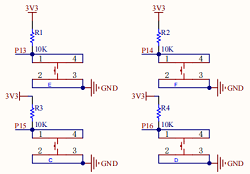

### 5.2.2 七彩灯

#### 5.2.2.1 简介


RGB LED是一种通过红、绿、蓝三原色混合光线实现成像的LED光源。其原理为利用三色光交集形成不同色彩，常见实现方式包括直接三原色混光、蓝光LED配合黄色荧光粉以及紫外LED结合RGB荧光粉。与直接呈现白光的LED相比，RGB LED因独立控制三原色而具备更广的混色范围。

按下 C 键时，彩灯按照 “红 - 绿 - 蓝 - 黄 - 紫” 的顺序交替闪烁；按下 D 键时，彩灯切换至呼吸灯模式；按下 E 键时，彩灯切换至流水灯模式；按下 F 键时，彩灯切换至跑马灯模式；而节日装饰用的彩色灯笼串、圣诞树彩灯，日常氛围营造用的 RGB 灯带、桌面氛围灯，以及游乐园设施、商场招牌上的 LED 装饰灯，都是生活中具备这类多模式切换功能的常见彩灯实例。


#### 5.2.2.2 元件知识


**SK6812 RGB彩灯**

| | |
| :--: | :--: |
| 实物图 | 控制板原理图 |

SK6812 是一款集成了控制电路与发光电路的智能外控 LED 光源，它的外观和 5x5mm的 顶面发光 LED 灯珠，每个灯珠本身就是一个独立像素点。这个像素点内部集成了多种核心电路：智能数字接口的数据锁存电路、信号整形放大驱动电路、电源稳压电路，还有内置的恒流电路和高精度 RC 振荡器。它的通讯采用单极性归零码协议，像素点上电复位后，会通过 DIN 端口接收控制器发来的数据。先收到的 24bit 数据会被第一个像素点提取并存入内部数据锁存器，剩下的数据则经过内部整形放大后，通过 DOUT 端口转发给下一级联的像素点，每经过一个像素点，传输的信号就会减少 24bit。

在手柄的控制板上，我们配置了四颗 SK6812 型号的 RGB 彩灯，这类彩灯支持 256 级亮度调节的红、绿、蓝三原色通道，可组合呈现 256×256×256 种色彩组合；借助这一特性，手柄能实现交替闪烁、呼吸渐变、跑马流动等多样化的灯光显示效果，让交互反馈更直观生动。

**轻触按键**

| | |
| :--: | :--: |
| 实物图 | 控制板原理图 |

轻触按键又叫按键开关，最早出现在日本，称之为敏感型开关，使用时以满足操作力的条件向开关操作方向施压开关功能闭合接通，当撤销压力时开关即断开，其内部结构是靠金属弹片受力变化来实现通断的。

在手柄的控制板上，我们集成了四颗轻触按键，且每颗按键均独立连接至 micro:bit 主板的一个引脚；当按压按键时，电路会触发相应的低电平信号，进而让 micro:bit 快速响应指令，大幅提升交互的便捷性与精准度。


#### 5.2.2.3 所需组件

| |   | | 
| :--: | :--: | :--: |
| **micro:bit V2 主板**（自备） ×1 | **micro:bit智能手柄控制板**（已组装） ×1 |**AAA 电池** （自备）x4 |


#### 5.2.2.4 代码流程图


#### 5.2.2.5 实验代码

⚠️ **特别注意：下面示例代码中，MODE\*_DELAY的延时时间值是可以根据实际情况加以修改的。**

**完整代码：**

```python
# import related libraries
from microbit import *
import neopixel, random, utime

# ==================== Configuration & Initialization ====================
BRIGHTNESS = 0.3        # Global brightness factor (0.0 to 0.9)
NP_NUM = 4              # Number of LEDs in the strip
strip = neopixel.NeoPixel(pin8, NP_NUM)

# Button Pins: Mapping JoyBit buttons to Pins
# C_KEY: Left, D_KEY: Right, E_KEY: Up, F_KEY: Down
KEYS = [pin15, pin16, pin13, pin14] 
for p in KEYS: 
    p.set_pull(p.PULL_UP)

# Global State Variables
mode = 0                # Current active mode (0-4)
last_btn_time = 0       # Global timestamp for button debouncing
# Shared state dictionary to handle indices and timing across modes
mode_data = {"idx": 0, "last_t": 0, "val": 0} 

# ==================== Utility Functions ====================
def get_rgb(h, s=99, l=15):
    """ Converts HSL to RGB and applies global brightness scaling """
    h %= 360
    s, l = s/100.0, l/100.0
    c = (1 - abs(2 * l - 1)) * s
    x = c * (1 - abs((h / 60) % 2 - 1))
    m = l - c / 2
    # Determine RGB sector based on Hue
    res = [(c,x,0), (x,c,0), (0,c,x), (0,x,c), (x,0,c), (c,0,x)][int(h/60)]
    return tuple(int((i + m) * 255 * BRIGHTNESS) for i in res)

def update_mode(new_mode):
    """ Resets mode states and clears the strip when switching modes """
    global mode
    mode = new_mode
    mode_data["idx"], mode_data["val"] = 0, 0
    mode_data["last_t"] = utime.ticks_ms()
    strip.fill((0, 0, 0))
    strip.show()

# ==================== Mode Behavior Definitions ====================
def run_m1(): # Mode 1: Solid Color Cycling
    colors = [(255,0,0), (0,255,0), (0,0,255), (255,255,0), (128,0,128)]
    rgb = tuple(int(i * BRIGHTNESS) for i in colors[mode_data["idx"]])
    strip.fill(rgb)
    mode_data["idx"] = (mode_data["idx"] + 1) % len(colors)

def run_m2(): # Mode 2: Smooth Rainbow Gradient (HSL)
    mode_data["val"] = (mode_data["val"] + 1) % 360
    strip.fill(get_rgb(mode_data["val"]))

def run_m3(): # Mode 3: Pixel Shifting with Random Colors
    # Shift existing pixels to the right
    for i in range(NP_NUM - 1, 0, -1): 
        strip[i] = strip[i-1]
    # Inject a new random color at the start
    strip[0] = get_rgb(random.randint(0, 360))

def run_m4(): # Mode 4: Chasing Single Pixel
    strip.fill((0,0,0)) # Clear all
    strip[mode_data["idx"]] = get_rgb(random.randint(0, 360), l=18)
    mode_data["idx"] = (mode_data["idx"] + 1) % NP_NUM

# Mode Map: Mode ID -> (Function to execute, delay in milliseconds)
MODES = {
    1: (run_m1, 500), 2: (run_m2, 5), 
    3: (run_m3, 200), 4: (run_m4, 200)
}

# ==================== Main Loop (Non-Blocking) ====================
while True:
    curr_t = utime.ticks_ms()
    
    # 1. Scan Buttons (Non-blocking debounce)
    for i, pin in enumerate(KEYS):
        if pin.read_digital() == 0 and utime.ticks_diff(curr_t, last_btn_time) > 200:
            last_btn_time = curr_t
            update_mode(i + 1) # i+1 maps 0-3 to modes 1-4
            break 

    # 2. Execute Mode Logic based on Timer
    if mode in MODES:
        func, delay = MODES[mode]
        if utime.ticks_diff(curr_t, mode_data["last_t"]) > delay:
            mode_data["last_t"] = curr_t
            func()
            strip.show()
    elif mode == 0:
        # Standby: Keep strip off and save CPU cycles
        strip.fill((0,0,0))
        strip.show()
        utime.sleep_ms(20)

```
**简单说明：**

① 导入库、配置常量、初始化 NeoPixel 灯带和按键引脚。
这段代码首先导入了 MicroPython 在 Micro:bit 上运行所需的核心库 `microbit`。接着，导入了 `neopixel` 库用于控制 NeoPixel LED 灯带，`random` 库用于生成随机数，以及 `utime` 库用于时间相关的操作（如获取当前时间戳和延时）。
然后，定义了几个重要的配置常量：`BRIGHTNESS` 用于全局控制灯带亮度（0.0到0.9），`NP_NUM` 指定 NeoPixel 灯带上的 LED 数量（这里是4个）。`strip` 对象被初始化，连接到 `pin8` 并包含 `NP_NUM` 个LED。
`KEYS` 列表定义了连接到 JoyBit 扩展板上的四个按键对应的 Micro:bit 引脚。通过循环为这些引脚设置上拉电阻 (`p.PULL_UP`)，这意味着按键未按下时引脚为高电平，按下时为低电平（方便检测）。
最后，定义了全局状态变量：`mode` 用于跟踪当前激活的灯光模式（0表示待机，1-4对应不同的灯光效果），`last_btn_time` 用于按键防抖的时间戳，`mode_data` 是一个字典，用于存储不同模式下需要共享或保持的状态信息（如索引、上次更新时间、值）。

```python
# import related libraries
from microbit import *
import neopixel, random, utime

# ==================== Configuration & Initialization ====================
BRIGHTNESS = 0.3        # Global brightness factor (0.0 to 0.9)
NP_NUM = 4              # Number of LEDs in the strip
strip = neopixel.NeoPixel(pin8, NP_NUM)

# Button Pins: Mapping JoyBit buttons to Pins
# C_KEY: Left, D_KEY: Right, E_KEY: Up, F_KEY: Down
KEYS = [pin15, pin16, pin13, pin14] 
for p in KEYS: 
    p.set_pull(p.PULL_UP)

# Global State Variables
mode = 0                # Current active mode (0-4)
last_btn_time = 0       # Global timestamp for button debouncing
# Shared state dictionary to handle indices and timing across modes
mode_data = {"idx": 0, "last_t": 0, "val": 0} 
```

② 工具函数：HSL 到 RGB 颜色转换与模式切换。
这部分定义了两个辅助函数：
*   `get_rgb(h, s, l)`：这是一个颜色转换函数，它接受 HSL（色相、饱和度、亮度）值，并将其转换为 RGB 格式。它还应用了全局亮度因子 `BRIGHTNESS`，确保所有颜色都受到亮度限制。这个函数使得生成各种颜色的灯光效果变得非常方便。
*   `update_mode(new_mode)`：此函数用于安全地切换灯光模式。当调用它切换到新模式时，它会更新全局 `mode` 变量，重置 `mode_data` 字典中的 `idx` 和 `val` 为 0，并将 `last_t` 更新为当前时间，以便新模式可以从头开始计时。同时，它会清空 NeoPixel 灯带，确保切换模式时没有残余的旧灯光效果。

```python
# ==================== Utility Functions ====================
def get_rgb(h, s=99, l=15):
    """ Converts HSL to RGB and applies global brightness scaling """
    h %= 360
    s, l = s/100.0, l/100.0
    c = (1 - abs(2 * l - 1)) * s
    x = c * (1 - abs((h / 60) % 2 - 1))
    m = l - c / 2
    # Determine RGB sector based on Hue
    res = [(c,x,0), (x,c,0), (0,c,x), (0,x,c), (x,0,c), (c,0,x)][int(h/60)]
    return tuple(int((i + m) * 255 * BRIGHTNESS) for i in res)

def update_mode(new_mode):
    """ Resets mode states and clears the strip when switching modes """
    global mode
    mode = new_mode
    mode_data["idx"], mode_data["val"] = 0, 0
    mode_data["last_t"] = utime.ticks_ms()
    strip.fill((0, 0, 0))
    strip.show()
```

③ 灯光模式行为定义和模式映射。
这部分定义了四个不同的灯光模式函数，每个函数都实现了独特的灯光效果：
*   `run_m1()` (模式1：纯色循环)：灯带会周期性地显示一组预设的纯色（红、绿、蓝、黄、紫），每次切换一个颜色。
*   `run_m2()` (模式2：彩虹渐变)：灯带会显示平滑的彩虹渐变效果，通过不断改变色相 (`mode_data["val"]`) 来实现。
*   `run_m3()` (模式3：像素移动与随机色)：灯带上的像素会向右移动，最左边的像素会被一个新的随机颜色填充，形成流动的效果。
*   `run_m4()` (模式4：追逐单像素)：灯带上只有一个像素亮起，并以追逐的方式在灯带上循环移动，每次亮起时颜色随机。
最后，`MODES` 字典将每个模式的 ID (1-4) 映射到其对应的执行函数和更新延迟时间（毫秒），这使得主循环可以方便地根据当前模式调用正确的函数并控制其更新频率。

```python
# ==================== Mode Behavior Definitions ====================
def run_m1(): # Mode 1: Solid Color Cycling
    colors = [(255,0,0), (0,255,0), (0,0,255), (255,255,0), (128,0,128)]
    rgb = tuple(int(i * BRIGHTNESS) for i in colors[mode_data["idx"]])
    strip.fill(rgb)
    mode_data["idx"] = (mode_data["idx"] + 1) % len(colors)

def run_m2(): # Mode 2: Smooth Rainbow Gradient (HSL)
    mode_data["val"] = (mode_data["val"] + 1) % 360
    strip.fill(get_rgb(mode_data["val"]))

def run_m3(): # Mode 3: Pixel Shifting with Random Colors
    # Shift existing pixels to the right
    for i in range(NP_NUM - 1, 0, -1): 
        strip[i] = strip[i-1]
    # Inject a new random color at the start
    strip[0] = get_rgb(random.randint(0, 360))

def run_m4(): # Mode 4: Chasing Single Pixel
    strip.fill((0,0,0)) # Clear all
    strip[mode_data["idx"]] = get_rgb(random.randint(0, 360), l=18)
    mode_data["idx"] = (mode_data["idx"] + 1) % NP_NUM

# Mode Map: Mode ID -> (Function to execute, delay in milliseconds)
MODES = {
    1: (run_m1, 500), 2: (run_m2, 5), 
    3: (run_m3, 200), 4: (run_m4, 200)
}
```

④ 主循环：按键扫描、模式执行与待机处理。
1.  按键扫描：它遍历 `KEYS` 列表中的每个按键引脚，检查是否有按键被按下（引脚读数为 `0`）。为了防止按键抖动导致多次触发，它使用了软件防抖机制：只有当距离上次按键操作超过 200 毫秒时，才响应新的按键。一旦检测到有效按键，它会调用 `update_mode()` 函数切换到对应的灯光模式（按键索引 `i` 加上 1 得到模式 ID），并更新 `last_btn_time`。
2.  模式执行：如果当前 `mode` 在 `MODES` 字典中（即不是待机模式），它会获取该模式对应的执行函数和更新延迟。然后，它会检查自上次该模式更新以来是否已超过设定的延迟时间。如果超过，则更新 `mode_data["last_t"]`，调用该模式的执行函数 (`func()`) 来更新灯带的颜色数据，并通过 `strip.show()` 将更新发送到灯带。
3.  待机处理：如果 `mode` 为 `0`（待机模式），程序会清空灯带 (`strip.fill((0,0,0))`)，显示熄灭状态，并通过 `utime.sleep_ms(20)` 引入短暂的延时，以节省 CPU 资源。

```python
# ==================== Main Loop (Non-Blocking) ====================
while True:
    curr_t = utime.ticks_ms()
    
    # 1. Scan Buttons (Non-blocking debounce)
    for i, pin in enumerate(KEYS):
        if pin.read_digital() == 0 and utime.ticks_diff(curr_t, last_btn_time) > 200:
            last_btn_time = curr_t
            update_mode(i + 1) # i+1 maps 0-3 to modes 1-4
            break 

    # 2. Execute Mode Logic based on Timer
    if mode in MODES:
        func, delay = MODES[mode]
        if utime.ticks_diff(curr_t, mode_data["last_t"]) > delay:
            mode_data["last_t"] = curr_t
            func()
            strip.show()
    elif mode == 0:
        # Standby: Keep strip off and save CPU cycles
        strip.fill((0,0,0))
        strip.show()
        utime.sleep_ms(20)
```

#### 5.2.2.6 实验结果


烧录程序后将micro:bit主板与组装好的手柄控制板连接（**需要安装电池**），将手柄控制板上的开关拨动到“ON”，当按下**C键**时，彩灯会以 **红-绿-蓝-黄-紫**的顺序交替闪烁；当按下**D键**时，彩灯会的色相会循环递增，最终实现彩灯循环渐变的效果；当按下**E键**时，彩灯从第0个像素开始产生一个随机颜色，随后逐次移位一个，最终实现彩色流水灯的效果；当按下**F键**时，彩灯会产生一个随机颜色，依次单个点亮每个像素，最终实现单个像素依次点亮且颜色随机的循环效果。


<span style="color: rgb(0, 209, 0);">（**特别提示：** 如果未看到实验现象，请用手按下micro:bit主板上背面的复位按钮，）</span>


