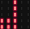

### 5.2.3 简易电子琴

#### 5.2.3.1 简介


通过操控 JoyBit 扩展模块的摇杆与按键，即可控制 micro:bit 的蜂鸣器播放不同音阶的乐符，同时 LED 点阵屏会同步显示对应数字标识：向右拨动摇杆时发出 “Do（中央 C 调）” 并显示 “1”，向左拨动发出 “Re（D 调）” 并显示 “2”，向上拨动发出 “Mi（E 调）” 并显示 “3”，向下拨动发出 “Fa（F 调）” 并显示 “4”；按下 C 键发出 “Sol（G 调）” 并显示 “5”，按下 D 键发出 “La（A 调）” 并显示 “6”，按下 E 键发出 “Si（B 调）” 并显示 “7”，按下 F 键则发出高八度的 “Do” 并再次显示 “1”，整体实现了摇杆、按键与音阶、数字显示的精准联动。


#### 5.2.3.2 元件知识


**Microbit扬声器**


micro:bit主板有内置扬声器，这使得添加声音变得非常容易。你可以用扬声器发出咯咯笑、问候你、打哈欠或悲伤等等，还可以编写一首歌曲，你的micro:bit主板可以通过编程制作各种各样的声音——从单个音符、音调和节拍到你自己的音乐作品，例如：歌曲《欢乐颂》，让扬声器播放出来。


#### 5.2.3.3 所需组件

| |   | | 
| :--: | :--: | :--: |
| **micro:bit V2 主板**（自备） ×1 | **micro:bit智能手柄控制板**（已组装） ×1 |**AAA 电池**（自备） x4 |

#### 5.2.3.4 代码流程图


#### 5.2.3.5 实验代码

⚠️ **特别注意：下面示例代码中，摇杆的可以根据实际情况加以修改的，从而对其灵敏度进行调节。**

**完整代码：**

```python
# import related libraries
from microbit import *
import music

# --- Configuration Constants ---
# Joystick and Button Mapping (Pin, Note, Display Character)
# For Joystick: (Pin, Threshold, Note, Character)
JOY_MAP = [(pin2, 600, 'c4:2', '1'), (pin2, 400, 'd4:2', '2'), 
           (pin1, 600, 'e4:2', '3'), (pin1, 400, 'f4:2', '4')]

# For Buttons: (Pin, Note, Character)
BTN_MAP = [(pin15, 'g4:2', '5'), (pin16, 'a4:2', '6'), 
           (pin13, 'b4:2', '7'), (pin14, 'c5:2', '1')]

# ==================== Initialization ====================
# Enable internal pull-up resistors for all button pins
for p, n, d in BTN_MAP: 
    p.set_pull(p.PULL_UP)

# Visual feedback on startup
display.show(Image.MUSIC_CROTCHET)

# ==================== Main Loop ====================
while True:
    # 1. Joystick Logic: Iterate through map and check analog thresholds
    for pin, thresh, note, disp in JOY_MAP:
        val = pin.read_analog()
        # Trigger if value exceeds high threshold or drops below low threshold
        if (thresh == 600 and val > 600) or (thresh == 400 and val < 400):
            music.play(note, wait=False)
            display.show(disp)

    # 2. Button Logic: Check for digital presses (Active Low)
    for pin, note, disp in BTN_MAP:
        if pin.read_digital() == 0: 
            music.play(note, wait=False)
            display.show(disp)
            # Debounce/Stutter protection: Wait until the button is released
            while pin.read_digital() == 0: 
                sleep(10)

    # Small delay to maintain system stability and reduce CPU load
    sleep(20)

```


**简单说明：**

① 导入库、配置常量和初始化。
这段代码首先导入了 `microbit` 库，用于访问 Micro:bit 的硬件功能，以及 `music` 库，用于播放音乐。
接着，定义了两个重要的配置常量列表：
*   `JOY_MAP`：用于配置摇杆的映射。每个元组包含摇杆连接的引脚、触发阈值（例如，高于600或低于400）、要播放的音乐音符（例如 'c4:2' 表示中央C音，持续2拍），以及在 Micro:bit LED 屏幕上显示的字符。
*   `BTN_MAP`：用于配置外部按钮的映射。每个元组包含按钮连接的引脚、要播放的音乐音符和在 Micro:bit LED 屏幕上显示的字符。
在初始化部分，程序遍历 `BTN_MAP` 中的所有按钮引脚，并为它们设置内部上拉电阻 (`p.PULL_UP`)。这意味着当按钮未按下时，引脚保持高电平；当按钮按下时，引脚被拉低至低电平，方便检测。最后，Micro:bit 的 LED 屏幕上会显示一个音符图标 (`Image.MUSIC_CROTCHET`)，作为程序启动的视觉反馈。

```python
# import related libraries
from microbit import *
import music

# --- Configuration Constants ---
# Joystick and Button Mapping (Pin, Note, Display Character)
# For Joystick: (Pin, Threshold, Note, Character)
JOY_MAP = [(pin2, 600, 'c4:2', '1'), (pin2, 400, 'd4:2', '2'), 
           (pin1, 600, 'e4:2', '3'), (pin1, 400, 'f4:2', '4')]

# For Buttons: (Pin, Note, Character)
BTN_MAP = [(pin15, 'g4:2', '5'), (pin16, 'a4:2', '6'), 
           (pin13, 'b4:2', '7'), (pin14, 'c5:2', '1')]

# ==================== Initialization ====================
# Enable internal pull-up resistors for all button pins
for p, n, d in BTN_MAP: 
    p.set_pull(p.PULL_UP)

# Visual feedback on startup
display.show(Image.MUSIC_CROTCHET)
```

② 主循环：处理摇杆输入。
程序进入一个无限循环 (`while True`)。首先处理摇杆的输入。它遍历 `JOY_MAP` 列表，对每个摇杆方向进行检查。对于每个摇杆引脚，它会读取其模拟值 (`pin.read_analog()`)。然后，根据预设的阈值 (`thresh`) 判断摇杆是否被拨动：如果阈值为 600 且当前模拟值大于 600（表示向一个方向拨动），或者阈值为 400 且当前模拟值小于 400（表示向另一个方向拨动），则认为摇杆被触发。一旦触发，程序会播放对应的音乐音符 (`music.play(note, wait=False)`)，`wait=False` 意味着音乐播放不会阻塞主循环，可以同时检测其他输入。同时，Micro:bit 的 LED 屏幕上会显示与该摇杆方向对应的字符。

```python
# ==================== Main Loop ====================
while True:
    # 1. Joystick Logic: Iterate through map and check analog thresholds
    for pin, thresh, note, disp in JOY_MAP:
        val = pin.read_analog()
        # Trigger if value exceeds high threshold or drops below low threshold
        if (thresh == 600 and val > 600) or (thresh == 400 and val < 400):
            music.play(note, wait=False)
            display.show(disp)
```

③ 主循环：处理按钮输入。
在处理完摇杆输入后，程序接着处理外部按钮的输入。它遍历 `BTN_MAP` 列表中的每个按钮。对于每个按钮引脚，它检查其数字读取值是否为 `0` (`pin.read_digital() == 0`)，这表示按钮被按下（因为引脚配置了上拉电阻，按下时会变为低电平）。如果按钮被按下，程序会播放对应的音乐音符 (`music.play(note, wait=False)`)，并在 Micro:bit 的 LED 屏幕上显示相应的字符。为了防止按键抖动或一次按键被多次识别，程序进入一个 `while` 循环，持续等待直到当前按钮被释放 (`while pin.read_digital() == 0: sleep(10)`)。这个等待过程会短暂地阻塞程序，直到按钮松开。

```python
    # 2. Button Logic: Check for digital presses (Active Low)
    for pin, note, disp in BTN_MAP:
        if pin.read_digital() == 0: 
            music.play(note, wait=False)
            display.show(disp)
            # Debounce/Stutter protection: Wait until the button is released
            while pin.read_digital() == 0: 
                sleep(10)
```

④ 主循环：循环延时。
在处理完摇杆和按钮的所有输入检测后，程序会暂停 20 毫秒 (`sleep(20)`)。这个短暂的延时有助于稳定系统，减少 CPU 负载，并为下一次循环的输入检测提供一个时间间隔。

```python
    # Small delay to maintain system stability and reduce CPU load
    sleep(20)
```

#### 5.2.3.6 实验结果


烧录程序后将micro:bit主板与组装好的手柄控制板连接（**需要安装电池**），将手柄控制板上的开关拨动到“ON”，LED点阵首先会显示“”，当摇杆向右拨动摇杆时发出 “Do（中央 C 调）” 并显示 “1”，向左拨动发出 “Re（D 调）” 并显示 “2”，向上拨动发出 “Mi（E 调）” 并显示 “3”，向下拨动发出 “Fa（F 调）” 并显示 “4”；按下 C 键发出 “Sol（G 调）” 并显示 “5”，按下 D 键发出 “La（A 调）” 并显示 “6”，按下 E 键发出 “Si（B 调）” 并显示 “7”，按下 F 键则发出高八度的 “Do” 并再次显示 “1”，最终实现简易电子琴的效果。


<span style="color: rgb(0, 209, 0);">（**特别提示：** 如果未看到实验现象，请用手按下micro:bit主板上背面的复位按钮，）</span>


