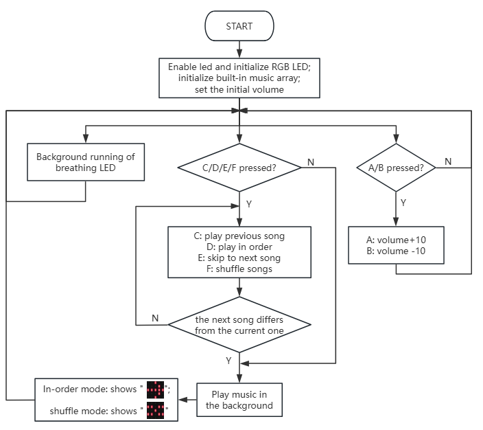

### 3.3.4 音乐播放器

#### 5.3.4.1 简介


音乐播放器是通过micro：bit主板板载蜂鸣器实现发声（不可播放人声音乐），内置 20 首简短音乐，支持顺序播放和随机播放两种模式：顺序模式下，按下 “上一首（C键）” 或 “下一首（E键）” 按键会按照预设顺序表切换曲目，播放至列表末尾后停止；随机模式下，每次按下切换按键会从 20 首铃声中随机选取一首播放，单首播放完毕后即停止，且播放期间彩灯会同步闪烁，micro:bit 的 LED 点阵屏还会实时显示当前的播放模式。


#### 5.3.4.2 所需组件

| |   | | 
| :--: | :--: | :--: |
| **micro:bit V2 主板**（自备） ×1 | **micro:bit智能手柄控制板**（已组装） ×1 |**AAA 电池** （自备）x4 |

#### 5.3.4.3 代码流程图



#### 5.3.4.4 实验代码

**完整代码：**

```python
# import related libraries
from microbit import *
import music, neopixel, random

# --- Configuration & Data ---
vol = 50
mode = 0  # 0: Manual, 1: Random
idx = 0
last_idx = -1
hue = 0
strip = neopixel.NeoPixel(pin8, 4)
melodies = ["DADADADUM", "ENTERTAINER", "PRELUDE", "ODE", "NYAN", "RINGTONE", "FUNK", "BLUES", 
            "BIRTHDAY", "WEDDING", "FUNERAL", "PUNCHLINE", "BADDY", "CHASE", "BA_DING", 
            "WAWAWAWAA", "JUMP_UP", "JUMP_DOWN", "POWER_UP", "POWER_DOWN"]

# Pin Initialization (P13-P16)
btns = [pin13, pin14, pin15, pin16]
for p in btns: p.set_pull(p.PULL_UP)
set_volume(vol)

def get_rgb(h):
    """ Simplified HSL to RGB logic """
    h %= 360
    pos = h // 60
    f = (h % 60) / 60.0
    v = 76 # 255 * 0.3 (Brightness coefficient)
    up, down = int(v * f), int(v * (1 - f))
    res = [(v, up, 0), (down, v, 0), (0, v, up), (0, down, v), (up, 0, v), (v, 0, down)]
    return res[pos]

# State tracking (for debouncing)
last_states = [1] * 4
last_press_t = 0

while True:
    curr_t = running_time()
    
    # 1. Volume Control (Buttons A/B)
    if button_a.was_pressed(): vol = min(250, vol + 10); set_volume(vol)
    if button_b.was_pressed(): vol = max(20, vol - 10); set_volume(vol)

    # 2. Joystick/Button Input Detection (with debouncing)
    for i, p in enumerate(btns):
        v = p.read_digital()
        if v == 0 and last_states[i] == 1 and (curr_t - last_press_t > 50):
            last_press_t = curr_t
            if i == 3: mode = 0; sleep(500)     # P16: Manual Mode
            elif i == 1: mode = 1; sleep(500)   # P14: Random Mode
            elif i == 2: # P15: Next track / Random track
                idx = random.randint(0, 19) if mode else (idx + 1) % 20
            elif i == 0: # P13: Previous track / Random track
                idx = random.randint(0, 19) if mode else (idx - 1) % 20
        last_states[i] = v

    # 3. Music Playback Logic
    if idx != last_idx:
        music.stop()
        try:
            music.play(getattr(music, melodies[idx]), wait=False)
            last_idx = idx
        except: pass

    # 4. Lighting & Display Updates
    hue = (hue + 1) % 360
    strip.fill(get_rgb(hue))
    strip.show()
    
    # Show Mode Icon: "X" for Random, Arrow for Manual
    display.show(Image("00000:99099:00900:99099:00000") if mode else Image.ARROW_E)
    
    sleep(10)

```


**简单说明：**

① 导入库、配置常量与初始化。
这段代码首先导入了 `microbit` 库，用于访问 Micro:bit 的核心功能；`music` 库，用于播放内置音乐；以及 `neopixel` 库，用于控制 NeoPixel LED 灯带；`random` 库用于生成随机数。
接着，定义了一系列全局变量和常量：`vol` 设置初始音量为 50；`mode` 变量控制音乐播放模式（0为手动选择，1为随机播放）；`idx` 存储当前播放的音乐索引；`last_idx` 用于跟踪上次播放的音乐索引，避免重复播放；`hue` 用于 NeoPixel 灯带的颜色控制；`strip` 初始化了一个连接到 `pin8` 且包含 4 个 LED 的 NeoPixel 灯带。`melodies` 列表包含了 MicroPython `music` 模块内置的所有音乐名称。
然后，`btns` 列表定义了连接到 Micro:bit 的 `pin13` 到 `pin16` 的四个外部按钮引脚，并通过循环为它们设置了内部上拉电阻 (`p.PULL_UP`)，这意味着按钮未按下时引脚为高电平，按下时为低电平。最后，`set_volume(vol)` 将 Micro:bit 的音量设置为初始值。

```python
# import related libraries
from microbit import *
import music, neopixel, random

# --- Configuration & Data ---
vol = 50
mode = 0  # 0: Manual, 1: Random
idx = 0
last_idx = -1
hue = 0
strip = neopixel.NeoPixel(pin8, 4)
melodies = ["DADADADUM", "ENTERTAINER", "PRELUDE", "ODE", "NYAN", "RINGTONE", "FUNK", "BLUES", 
            "BIRTHDAY", "WEDDING", "FUNERAL", "PUNCHLINE", "BADDY", "CHASE", "BA_DING", 
            "WAWAWAWAA", "JUMP_UP", "JUMP_DOWN", "POWER_UP", "POWER_DOWN"]

# Pin Initialization (P13-P16)
btns = [pin13, pin14, pin15, pin16]
for p in btns: p.set_pull(p.PULL_UP)
set_volume(vol)
```

② 颜色转换函数与防抖变量。
`get_rgb(h)` 函数是一个简化的 HSL（色相、饱和度、亮度）到 RGB 颜色转换函数。它接受一个色相值 `h`（0-359），并将其转换为一个 RGB 元组。这里的亮度 `v` 被固定为 76（大约是 255 * 0.3，对应于 `BRIGHTNESS` 系数）。这个函数使得根据色相值生成彩虹色变得容易。
`last_states` 列表用于存储四个按钮的上一次状态，初始都为 1（高电平，未按下）。`last_press_t` 变量用于记录上次按钮按下的时间，这两个变量共同实现了软件防抖功能，防止一次按键被多次识别。

```python
def get_rgb(h):
    """ Simplified HSL to RGB logic """
    h %= 360
    pos = h // 60
    f = (h % 60) / 60.0
    v = 76 # 255 * 0.3 (Brightness coefficient)
    up, down = int(v * f), int(v * (1 - f))
    res = [(v, up, 0), (down, v, 0), (0, v, up), (0, down, v), (up, 0, v), (v, 0, down)]
    return res[pos]

# State tracking (for debouncing)
last_states = [1] * 4
last_press_t = 0
```

③ 主循环：音量控制。
程序进入一个无限循环 (`while True`)。首先，它获取当前运行时间 `curr_t`。
接着，处理 Micro:bit 板载的 A 和 B 按钮：
*   如果 `button_a` 被按下 (`button_a.was_pressed()`)，音量 `vol` 会增加 10，但最大不超过 250。然后调用 `set_volume(vol)` 更新系统音量。
*   如果 `button_b` 被按下 (`button_b.was_pressed()`)，音量 `vol` 会减少 10，但最小不低于 20。然后调用 `set_volume(vol)` 更新系统音量。
`was_pressed()` 方法只在按钮从未按下状态变为按下状态时返回 `True` 一次，这本身就具有一定的防抖效果。

```python
while True:
    curr_t = running_time()
    
    # 1. Volume Control (Buttons A/B)
    if button_a.was_pressed(): vol = min(250, vol + 10); set_volume(vol)
    if button_b.was_pressed(): vol = max(20, vol - 10); set_volume(vol)
```

④ 主循环：按钮输入检测与模式切换。
这部分代码遍历 `btns` 列表中的四个外部按钮 (`pin13` 到 `pin16`)，检测它们的按下状态。它使用软件防抖逻辑：只有当按钮从高电平（未按下）变为低电平（按下），并且距离上次有效按键操作超过 50 毫秒时，才响应按键。
*   如果 `pin16` 被按下 (`i == 3`)，将 `mode` 设置为 0（手动模式），并暂停 500 毫秒。
*   如果 `pin14` 被按下 (`i == 1`)，将 `mode` 设置为 1（随机模式），并暂停 500 毫秒。
*   如果 `pin15` 被按下 (`i == 2`)，根据当前模式更新音乐索引 `idx`：如果是随机模式，则随机选择一首音乐；如果是手动模式，则播放下一首音乐。
*   如果 `pin13` 被按下 (`i == 0`)，同样根据当前模式更新音乐索引 `idx`：如果是随机模式，则随机选择一首音乐；如果是手动模式，则播放上一首音乐。
每次循环结束时，`last_states[i] = v` 会更新当前按钮的状态，为下一次防抖检测做准备。

```python
    # 2. Joystick/Button Input Detection (with debouncing)
    for i, p in enumerate(btns):
        v = p.read_digital()
        if v == 0 and last_states[i] == 1 and (curr_t - last_press_t > 50):
            last_press_t = curr_t
            if i == 3: mode = 0; sleep(500)     # P16: Manual Mode
            elif i == 1: mode = 1; sleep(500)   # P14: Random Mode
            elif i == 2: # P15: Next track / Random track
                idx = random.randint(0, 19) if mode else (idx + 1) % 20
            elif i == 0: # P13: Previous track / Random track
                idx = random.randint(0, 19) if mode else (idx - 1) % 20
        last_states[i] = v
```

⑤ 主循环：音乐播放逻辑。
这段代码负责控制音乐的播放。它检查当前的音乐索引 `idx` 是否与上次播放的音乐索引 `last_idx` 不同。如果不同，说明需要切换音乐：
1.  `music.stop()` 停止当前正在播放的音乐。
2.  尝试使用 `music.play(getattr(music, melodies[idx]), wait=False)` 播放新的音乐。`getattr(music, melodies[idx])` 动态获取 `music` 模块中对应名称的音乐数据。`wait=False` 确保音乐播放不会阻塞主循环。
3.  如果播放成功，更新 `last_idx = idx`。
4.  使用 `try...except` 块捕获潜在的错误，例如 `melodies` 列表中可能存在无效的音乐名称。

```python
    # 3. Music Playback Logic
    if idx != last_idx:
        music.stop()
        try:
            music.play(getattr(music, melodies[idx]), wait=False)
            last_idx = idx
        except: pass
```

⑥ 主循环：灯光与显示更新。
这部分代码负责更新 NeoPixel 灯带的颜色和 Micro:bit LED 屏幕的显示：
1.  `hue = (hue + 1) % 360` 持续增加 `hue` 值，使其在 0 到 359 之间循环，从而实现彩虹色渐变效果。
2.  `strip.fill(get_rgb(hue))` 使用 `get_rgb` 函数根据当前的 `hue` 值生成颜色，并用这个颜色填充整个 NeoPixel 灯带。
3.  `strip.show()` 将更新后的颜色数据发送到 NeoPixel 灯带，使其显示出来。
4.  `display.show(...)` 根据当前的 `mode` 显示不同的图标：如果 `mode` 为 1（随机模式），则显示一个自定义的“X”形图案；如果 `mode` 为 0（手动模式），则显示一个向右的箭头 (`Image.ARROW_E`)。
最后，`sleep(10)` 引入一个短暂的延时，以控制主循环的执行速度，减少 CPU 负载，并使视觉效果更平滑。

```python
    # 4. Lighting & Display Updates
    hue = (hue + 1) % 360
    strip.fill(get_rgb(hue))
    strip.show()
    
    # Show Mode Icon: "X" for Random, Arrow for Manual
    display.show(Image("00000:99099:00900:99099:00000") if mode else Image.ARROW_E)
    
    sleep(10)
```
#### 5.3.4.5 实验结果


烧录程序后将micro:bit主板与组装好的手柄控制板连接（**需要安装电池**），将手柄控制板上的开关拨动到“ON”，设备开机后默认处于顺序模式，会自动播放音乐列表中索引为 “0” 号位置的音乐，单首播放完毕后即停止，此时按下 C 键可播放上一首音乐、按下 E 键可播放下一首音乐，按下 F 键可切换至随机模式，按下 D 键则可切换回顺序模式；在随机模式下，按下 C 键或 E 键都会从 20 首音乐中随机选取一首进行播放，单首播放完毕后即停止；设备开机后 RGB 彩灯会持续以彩色呼吸灯的效果闪烁，同时 micro:bit 的 LED 点阵在顺序模式下显示 “”、在随机模式下显示 “”，此外按下 A 键可增大音量、按下 B 键可减小音量，通过以上操作即可实现本实验的最终效果。


<span style="color: rgb(0, 209, 0);">（**特别提示：** 如果未看到实验现象，请用手按下micro:bit主板上背面的复位按钮，）</span>


