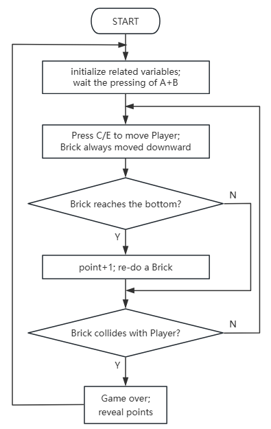

### 5.2.5 躲避砖块

#### 5.2.5.1 简介


本实验是做了一个躲避砖块的游戏，玩家通过micro:bit手柄控制代表玩家的LED灯左右移动，躲避从上方侧不断向下移动的砖块障碍物。游戏包含三个状态：未开始时的动态图标展示、运行中的实时躲避操作以及碰撞后的得分显示。玩家每成功躲避一个砖块（砖块移动到最下方边界）可获得1分，当光标与砖块在同一位置相撞时游戏结束，系统会以滚动效果显示最终得分。游戏支持通过A+B组合键进行开始与重置操作，整个游戏机制简洁明了，结合了实时反应与策略预判的玩法体验。


#### 5.2.5.2 所需组件

| |   | | 
| :--: | :--: | :--: |
| **micro:bit V2 主板**（自备） ×1 | **micro:bit智能手柄控制板**（已组装） ×1 |**AAA 电池**（自备） x4 |

#### 5.2.5.3 代码流程图



#### 5.2.5.4 实验代码

⚠️ **特别注意：下面示例代码中，初始化的阈值''brick_move_speed=300''可以根据实际情况加以修改的，数字越大砖块下落越慢，数字越小砖块下落越块**

**完整代码：**
 

```python
import utime
import random
from microbit import *

# ===================== Global Configuration & Variables =====================
# Player initial configuration (micro:bit pixel coordinates: col=column(0-4, left-right), row=row(0-4, top-bottom))
player_fixed_row = 4    # Player's fixed row (bottom row)
player_init_col = 4     # Player's initial column (center)
brick_move_speed = 300  # Brick falling interval (ms)

# Game state: 0=not started 1=running 2=game over
game_state = 0
brick_x = 0             # Brick current column (left-right)
brick_y = 0             # Brick current row (top-bottom)
score = 0               # Score counter
a_pressed_flag = False  # Left move button debounce flag
b_pressed_flag = False  # Right move button debounce flag
collision_x = False     # Collision detection - same column
collision_y = False     # Collision detection - same row
flash_count = 0         # End screen flash counter
time_passed = 0         # Time difference (for brick falling)
current_time = 0        # Current timestamp
last_brick_time = 0     # Last brick falling timestamp
start_flag = 0          # Start button debounce flag
can_start = False       # Game start flag
ab_pressed = False      # A+B pressed simultaneously flag
player_col = player_init_col  # Player's current column

# Initialize pins with pull-up (PULL_UP: pressed=low level 0, released=high level 1)
pin13.set_pull(pin13.PULL_UP)  # Right move button
pin15.set_pull(pin15.PULL_UP)  # Left move button

# ===================== Core Functions =====================
def on_start():
    """Initialization on power-up: randomly generate initial brick column"""
    global brick_x
    brick_x = random.randint(0, 4)

def draw_game():
    """Draw game screen: player (bright) + brick (dim)"""
    global game_state, player_col, brick_x, brick_y
    display.clear()
    # Draw player (fixed at bottom row, brightness 9 = brightest)
    display.set_pixel(player_col, player_fixed_row, 9)
    # Draw brick during gameplay (brightness 3 = dim)
    if game_state == 1:
        display.set_pixel(brick_x, brick_y, 7)

def reset_game():
    """Reset all game states"""
    global game_state, player_col, brick_x, brick_y, score
    global a_pressed_flag, b_pressed_flag
    game_state = 1
    player_col = player_init_col
    brick_x = random.randint(0, 4)
    brick_y = 0
    score = 0
    a_pressed_flag = False
    b_pressed_flag = False
    display.clear()

def check_collision():
    """Collision detection: game over if brick is in same column and row as player"""
    global collision_x, collision_y, game_state, flash_count
    collision_x = (brick_x == player_col)
    collision_y = (brick_y == player_fixed_row)
    if collision_x and collision_y:
        game_state = 2
        display.clear()
        flash_count = 0

# ===================== Main Loop =====================
def on_forever():
    """Main game logic loop"""
    global ab_pressed, can_start, start_flag, last_brick_time
    global flash_count, player_col, a_pressed_flag, b_pressed_flag
    global current_time, time_passed, brick_x, brick_y, score

    # 1. A+B pressed simultaneously: start/reset game (debounced)
    ab_pressed = button_a.is_pressed() and button_b.is_pressed()
    can_start = ab_pressed and (game_state != 1)
    if can_start:
        if start_flag == 0:
            start_flag = 1
            utime.sleep_ms(20)
            if button_a.is_pressed() and button_b.is_pressed():
                reset_game()
                last_brick_time = running_time()
    else:
        start_flag = 0

    # 2. Game not started state
    if game_state == 0:
        display.show(Image.DIAMOND_SMALL)
        utime.sleep_ms(500)
        display.show(Image.DIAMOND)
        utime.sleep_ms(500)

    # 3. Game over state
    if game_state == 2:
        if flash_count < 3:
            display.scroll(score)
            utime.sleep_ms(300)
            display.clear()
            utime.sleep_ms(200)
            flash_count += 1
        else:
            display.scroll(score)
            utime.sleep_ms(500)

    # 4. Game running logic
    if game_state == 1:
        # Left move button (pin15): fix level detection + set flag only on successful move
        if not pin15.read_digital():  # Pressed = low level 0, trigger left move
            if not a_pressed_flag:
                if player_col > 0:
                    player_col -= 1
                    a_pressed_flag = True  # Only set flag on successful move
                    utime.sleep_ms(50)
        else:
            a_pressed_flag = False  # Reset flag immediately when button is released

        # Right move button (pin13): fix level detection + set flag only on successful move
        if not pin13.read_digital():  # Pressed = low level 0, trigger right move
            if not b_pressed_flag:
                if player_col < 4:
                    player_col += 1
                    b_pressed_flag = True  # Only set flag on successful move
                    utime.sleep_ms(50)
        else:
            b_pressed_flag = False  # Reset flag immediately when button is released

        # Brick falling logic
        current_time = running_time()
        time_passed = current_time - last_brick_time
        if time_passed > brick_move_speed:
            last_brick_time = current_time
            brick_y += 1
            if brick_y > 4:
                brick_x = random.randint(0, 4)
                brick_y = 0
                score += 1

        # Collision detection + screen refresh
        check_collision()
        draw_game()

# ===================== Program Entry Point =====================
if __name__ == "__main__":
    on_start()
    while True:
        on_forever()
        utime.sleep_ms(10)
```


**简单说明：**

① 导入库、全局配置与变量初始化。
这段代码首先导入了 `utime` 库用于时间操作（如延时），`random` 库用于生成随机数，以及 `microbit` 库用于访问 Micro:bit 的硬件功能。
接着，定义了一系列全局变量和常量来配置游戏：
*   `player_fixed_row` 和 `player_init_col` 定义了玩家的初始位置（固定在最底行，初始在中间）。
*   `brick_move_speed` 设置了砖块下落的时间间隔（毫秒）。
*   `game_state` 跟踪游戏状态（0=未开始，1=运行中，2=游戏结束）。
*   `brick_x`, `brick_y` 存储砖块的当前坐标。
*   `score` 记录得分。
*   `a_pressed_flag`, `b_pressed_flag` 用于玩家左右移动按钮的防抖。
*   `collision_x`, `collision_y` 用于碰撞检测。
*   `flash_count` 用于游戏结束时的闪烁效果。
*   `time_passed`, `current_time`, `last_brick_time` 用于砖块下落的计时。
*   `start_flag`, `can_start`, `ab_pressed` 用于游戏开始/重置按钮的防抖和状态。
*   `player_col` 存储玩家的当前列位置。
最后，代码将 `pin13` 和 `pin15`（用于左右移动按钮）配置为内部上拉电阻 (`pinX.PULL_UP`)，这意味着当按钮未按下时引脚为高电平 (1)，按下时为低电平 (0)。

```python
import utime
import random
from microbit import *

# ===================== Global Configuration & Variables =====================
# Player initial configuration (micro:bit pixel coordinates: col=column(0-4, left-right), row=row(0-4, top-bottom))
player_fixed_row = 4    # Player's fixed row (bottom row)
player_init_col = 4     # Player's initial column (center)
brick_move_speed = 300  # Brick falling interval (ms)

# Game state: 0=not started 1=running 2=game over
game_state = 0
brick_x = 0             # Brick current column (left-right)
brick_y = 0             # Brick current row (top-bottom)
score = 0               # Score counter
a_pressed_flag = False  # Left move button debounce flag
b_pressed_flag = False  # Right move button debounce flag
collision_x = False     # Collision detection - same column
collision_y = False     # Collision detection - same row
flash_count = 0         # End screen flash counter
time_passed = 0         # Time difference (for brick falling)
current_time = 0        # Current timestamp
last_brick_time = 0     # Last brick falling timestamp
start_flag = 0          # Start button debounce flag
can_start = False       # Game start flag
ab_pressed = False      # A+B pressed simultaneously flag
player_col = player_init_col  # Player's current column

# Initialize pins with pull-up (PULL_UP: pressed=low level 0, released=high level 1)
pin13.set_pull(pin13.PULL_UP)  # Right move button
pin15.set_pull(pin15.PULL_UP)  # Left move button
```

② 核心功能函数定义。
这部分定义了游戏运行所需的三个核心函数：
*   `on_start()`：在程序启动时调用，主要用于初始化砖块的起始列位置，使其随机出现在 0 到 4 之间。
*   `draw_game()`：负责在 Micro:bit 的 5x5 LED 屏幕上绘制游戏元素。它首先清空屏幕，然后以最高亮度 (9) 绘制玩家（固定在最底行 `player_fixed_row`，列由 `player_col` 决定）。如果游戏处于运行状态 (`game_state == 1`)，它会以中等亮度 (7) 绘制砖块。
*   `reset_game()`：用于将游戏重置到初始运行状态。它将 `game_state` 设置为 1，重置玩家位置、砖块位置和得分，并清除按键防抖标志，最后清空屏幕。
*   `check_collision()`：检测砖块和玩家是否发生碰撞。它通过比较砖块和玩家的 `x` 坐标 (`brick_x == player_col`) 和 `y` 坐标 (`brick_y == player_fixed_row`) 来判断。如果两者都匹配，则表示发生碰撞，游戏状态 `game_state` 被设置为 2（游戏结束），屏幕清空，并重置 `flash_count`。

```python
# ===================== Core Functions =====================
def on_start():
    """Initialization on power-up: randomly generate initial brick column"""
    global brick_x
    brick_x = random.randint(0, 4)

def draw_game():
    """Draw game screen: player (bright) + brick (dim)"""
    global game_state, player_col, brick_x, brick_y
    display.clear()
    # Draw player (fixed at bottom row, brightness 9 = brightest)
    display.set_pixel(player_col, player_fixed_row, 9)
    # Draw brick during gameplay (brightness 3 = dim)
    if game_state == 1:
        display.set_pixel(brick_x, brick_y, 7)

def reset_game():
    """Reset all game states"""
    global game_state, player_col, brick_x, brick_y, score
    global a_pressed_flag, b_pressed_flag
    game_state = 1
    player_col = player_init_col
    brick_x = random.randint(0, 4)
    brick_y = 0
    score = 0
    a_pressed_flag = False
    b_pressed_flag = False
    display.clear()

def check_collision():
    """Collision detection: game over if brick is in same column and row as player"""
    global collision_x, collision_y, game_state, flash_count
    collision_x = (brick_x == player_col)
    collision_y = (brick_y == player_fixed_row)
    if collision_x and collision_y:
        game_state = 2
        display.clear()
        flash_count = 0
```

③ 主循环：游戏开始/重置逻辑。
`on_forever()` 函数是游戏的主循环逻辑。
首先，它检测 Micro:bit 板载的 A 和 B 按钮是否同时被按下 (`button_a.is_pressed() and button_b.is_pressed()`)。`can_start` 标志在 A+B 同时按下且游戏未运行时为真。
如果 `can_start` 为真，并且 `start_flag` 为 0（表示这是 A+B 按钮首次被检测到同时按下），则设置 `start_flag` 为 1，进行短时间延时 (`utime.sleep_ms(20)`)，再次确认 A+B 按钮仍被按下（这是为了简单的防抖）。如果确认，则调用 `reset_game()` 函数开始新游戏，并记录 `last_brick_time`。
如果 A+B 按钮没有同时按下，`start_flag` 被重置为 0。

```python
# ===================== Main Loop =====================
def on_forever():
    """Main game logic loop"""
    global ab_pressed, can_start, start_flag, last_brick_time
    global flash_count, player_col, a_pressed_flag, b_pressed_flag
    global current_time, time_passed, brick_x, brick_y, score

    # 1. A+B pressed simultaneously: start/reset game (debounced)
    ab_pressed = button_a.is_pressed() and button_b.is_pressed()
    can_start = ab_pressed and (game_state != 1)
    if can_start:
        if start_flag == 0:
            start_flag = 1
            utime.sleep_ms(20)
            if button_a.is_pressed() and button_b.is_pressed():
                reset_game()
                last_brick_time = running_time()
    else:
        start_flag = 0
```

④ 主循环：游戏未开始和游戏结束状态的显示。
*   **游戏未开始 (`game_state == 0`)**：在此状态下，Micro:bit 屏幕会交替显示小钻石 (`Image.DIAMOND_SMALL`) 和大钻石 (`Image.DIAMOND`)，每次显示间隔 500 毫秒，作为等待玩家开始游戏的提示。
*   **游戏结束 (`game_state == 2`)**：如果游戏结束，程序会进入一个闪烁显示分数的循环。`flash_count` 限制了闪烁次数（这里是 3 次）。每次闪烁，它会滚动显示当前得分，然后清屏，再短暂延时。闪烁 3 次后，它会再次滚动显示最终得分，并暂停 500 毫秒。

```python
    # 2. Game not started state
    if game_state == 0:
        display.show(Image.DIAMOND_SMALL)
        utime.sleep_ms(500)
        display.show(Image.DIAMOND)
        utime.sleep_ms(500)

    # 3. Game over state
    if game_state == 2:
        if flash_count < 3:
            display.scroll(score)
            utime.sleep_ms(300)
            display.clear()
            utime.sleep_ms(200)
            flash_count += 1
        else:
            display.scroll(score)
            utime.sleep_ms(500)
```

⑤ 主循环：游戏运行中的逻辑。
当 `game_state == 1`（游戏运行中）时，执行以下逻辑：
*   **玩家左右移动**：
    *   检测 `pin15`（左移按钮）：如果 `pin15` 被按下（读数为 0），并且 `a_pressed_flag` 为 `False`（防止连续触发），且玩家不在最左边 (`player_col > 0`)，则玩家向左移动一格 (`player_col -= 1`)，设置 `a_pressed_flag` 为 `True`，并短暂延时 50 毫秒。如果 `pin15` 未被按下，`a_pressed_flag` 被重置为 `False`。
    *   检测 `pin13`（右移按钮）：逻辑与左移类似，如果 `pin13` 被按下，且 `b_pressed_flag` 为 `False`，且玩家不在最右边 (`player_col < 4`)，则玩家向右移动一格 (`player_col += 1`)，设置 `b_pressed_flag` 为 `True`，并短暂延时 50 毫秒。如果 `pin13` 未被按下，`b_pressed_flag` 被重置为 `False`。
*   **砖块下落逻辑**：
    *   获取当前时间 `current_time`，计算自上次砖块下落以来经过的时间 `time_passed`。
    *   如果 `time_passed` 超过 `brick_move_speed`，则更新 `last_brick_time`，砖块向下移动一格 (`brick_y += 1`)。
    *   如果砖块落到屏幕底部以下 (`brick_y > 4`)，则将其重置到屏幕顶部的随机列 (`brick_x = random.randint(0, 4)`)，`brick_y` 归零，并增加得分 `score`。
*   **碰撞检测与画面绘制**：
    *   调用 `check_collision()` 函数检测玩家和砖块是否碰撞。
    *   调用 `draw_game()` 函数更新 Micro:bit 屏幕上的显示。

```python
    # 4. Game running logic
    if game_state == 1:
        # Left move button (pin15): fix level detection + set flag only on successful move
        if not pin15.read_digital():  # Pressed = low level 0, trigger left move
            if not a_pressed_flag:
                if player_col > 0:
                    player_col -= 1
                    a_pressed_flag = True  # Only set flag on successful move
                    utime.sleep_ms(50)
        else:
            a_pressed_flag = False  # Reset flag immediately when button is released

        # Right move button (pin13): fix level detection + set flag only on successful move
        if not pin13.read_digital():  # Pressed = low level 0, trigger right move
            if not b_pressed_flag:
                if player_col < 4:
                    player_col += 1
                    b_pressed_flag = True  # Only set flag on successful move
                    utime.sleep_ms(50)
        else:
            b_pressed_flag = False  # Reset flag immediately when button is released

        # Brick falling logic
        current_time = running_time()
        time_passed = current_time - last_brick_time
        if time_passed > brick_move_speed:
            last_brick_time = current_time
            brick_y += 1
            if brick_y > 4:
                brick_x = random.randint(0, 4)
                brick_y = 0
                score += 1

        # Collision detection + screen refresh
        check_collision()
        draw_game()
```

⑥ 程序入口点。
这部分是程序的实际执行起点。
`if __name__ == "__main__":` 确保这段代码只在脚本作为主程序运行时执行。
首先，调用 `on_start()` 进行一次性初始化。
然后，进入一个无限循环 (`while True`)，在每次循环中：
*   调用 `on_forever()` 函数，执行游戏的所有核心逻辑。
*   短暂延时 10 毫秒 (`utime.sleep_ms(10)`)，以控制主循环的执行频率，减少 CPU 负载，并确保游戏更新速度适中。

```python
# ===================== Program Entry Point =====================
if __name__ == "__main__":
    on_start()
    while True:
        on_forever()
        utime.sleep_ms(10)
```
#### 5.2.5.5 实验结果


烧录程序后将micro:bit主板与组装好的手柄控制板连接（**需要安装电池**），将手柄控制板上的开关拨动到“ON”，此时会以“”进行闪烁，此时便是处于**0-初始状态**，当同时按下A键和B键时（为防止误触需要按下1秒左右）会切换到游戏开始状态，此时便是处于**1-游戏中**，砖块会随机从一列落下，玩家可以通过按C键进行左移，E键进行右移，当玩家每躲避一个砖块便得分+1，否则游戏结束，进入游戏结束状态；此时便是处于**2-游戏结束**，此时会显示玩家得分，当再次同时按下A键和B键时，便开启新一轮游戏，知道玩家关闭电源（将手柄上的开关拨动到“OFF”）。


<span style="color: rgb(0, 209, 0);">（**特别提示：** 如果未看到实验现象，请用手按下micro:bit主板上背面的复位按钮，）</span>


