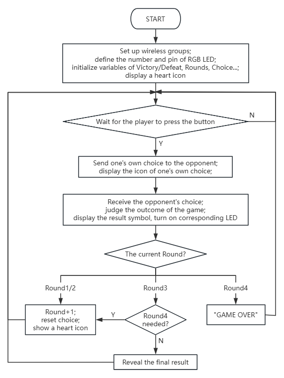

### 5.2.6 猜拳游戏

#### 5.2.6.1 简介


本实验基于 micro:bit 做了一个双人无线对战石头剪刀布游戏，玩家通过 手柄上的按键选择石头 / 剪刀 / 布出拳，两台设备借助无线电通信完成对战数据互通。游戏采用 3 局制规则，前三局结束后若出现三局全平或一胜一负一平的情况，将触发第四局加赛；每局胜负通过 micro:bit 屏幕符号（W 胜 / L 负 /= 平）和 P8 引脚的 RGB彩灯（绿胜 / 红负 / 黄平）可视化反馈，整轮游戏结束后系统自动重置数据与彩灯，等待下一轮对战，整体玩法结合了无线交互与多局制对战的趣味体验。


#### 5.2.6.2 元件知识


**Microbit 无线电**


micro:bit主板有内置 **2.4GHz 射频（Radio）和低功耗蓝牙（BLE）** 两种便捷的无线通信功能，2.4GHz射频和低功耗蓝牙不能同时使用。其中，2.4GHz 射频通信无需配对，支持设置 255 个独立分组避免干扰，通信距离可达 10–30 米，能快速传输数字、字符串等数据，低功耗蓝牙则主要用于与手机、平板等智能设备配对，可实现传感器数据上传、手机 APP 遥控等物联网场景应用，为 micro:bit 的创意开发拓展了更多可能性。

#### 5.2.6.3 所需组件

| |   | | 
| :--: | :--: | :--: |
| **micro:bit V2 主板**（自备） ×2 | **micro:bit智能手柄控制板**（已组装） ×2 |**AAA 电池** （自备）x8 |

#### 5.2.6.4 代码流程图



#### 5.2.6.5 实验代码

**完整代码：**


```python
from microbit import *
import neopixel
import radio

# Global Variables
round2 = 1
check = 1
me = 0
you = 0
wins = 0
loses = 0
draws = 0
gameResults = []
strip = None

pin13.set_pull(pin13.PULL_UP)
pin15.set_pull(pin15.PULL_UP)
pin16.set_pull(pin16.PULL_UP)
# Initialize LED strip (4 LEDs, connected to pin P8)
strip = neopixel.NeoPixel(pin8, 4)

# Reset game state
def resetGame():
    global me, you, round2, wins, loses, draws, gameResults, check
    me = 0
    you = 0
    round2 = 1
    wins = 0
    loses = 0
    draws = 0
    gameResults = []
    check = 1
    resetLights()
    display.show(Image.HEART)

# Receive opponent's choice via radio
def on_received_message(receivedMsg):
    global you
    if you == 0:
        # Convert string to integer if needed
        if isinstance(receivedMsg, str) and receivedMsg in ['1', '2', '3']:
            you = int(receivedMsg)
        # Use directly if it's an integer
        elif isinstance(receivedMsg, int) and receivedMsg in [1, 2, 3]:
            you = receivedMsg

# Turn off all LEDs
def resetLights():
    for i in range(4):
        strip[i] = (0, 0, 0)  # Off
    strip.show()

# Check if a 4th round is needed
def needFourthRound():
    # Case 1: All 3 draws -> need 4th round, return 2
    if wins == 0 and loses == 0 and draws == 3:
        return 2
    # Case 2: 1 win, 1 loss, 1 draw -> need 4th round, return 1
    if wins == 1 and loses == 1 and draws == 1:
        return 1
    # No 4th round needed
    return 0

# Show round result on LED strip
def showRoundResult(roundNum, result):
    if roundNum <= 4:
        if result == 1:
            # Win: Green
            strip[roundNum - 1] = (0, 255, 0)
        elif result == 0:
            # Draw: Yellow
            strip[roundNum - 1] = (255, 255, 0)
        else:
            # Lose: Red
            strip[roundNum - 1] = (255, 0, 0)
        strip.show()

# Game initialization
radio.on()
radio.config(group=1)
check = 1
me = 0
you = 0
strip.clear()
strip.show()
display.show(Image.HEART)

# Main game loop
while True:

    # Process result when both players have chosen
    if me != 0 and you != 0:
        # Current round result: 1=win, 0=draw, -1=lose
        resultSymbol = "="
        # Determine round outcome
        if me == you:
            resultSymbol = "="
            # Draw
            result2 = 0
            draws += 1
        elif me == 2 and you == 1 or (me == 3 and you == 2 or me == 1 and you == 3):
            resultSymbol = "W"
            # Win
            result2 = 1
            wins += 1
        else:
            resultSymbol = "L"
            # Lose
            result2 = -1
            loses += 1

        # Save round result
        gameResults.append(result2)

        # Display result symbol
        display.show(resultSymbol)

        # Update LED strip
        showRoundResult(round2, result2)

        sleep(3000)

        # Check if game continues
        if round2 == 3:
            # After 3 rounds, check for 4th round
            fourth_round_needed = needFourthRound()
            if fourth_round_needed:
                # Go to 4th round
                round2 = 4
                if fourth_round_needed == 2:
                    display.scroll("FINAL")
                sleep(1000)
                display.show(Image.HEART)
                check = 1
                me = 0
                you = 0
            else:
                # End game
                if wins > loses:
                    display.scroll("WINNER")
                elif loses > wins:
                    display.scroll("LOSER")
                else:
                    display.scroll("TIE")
                sleep(3000)
                resetGame()
        elif round2 == 4:
            # 4th round finished, game over
            display.scroll("GAME OVER")
            sleep(3000)
            resetGame()
        else:
            # Next round (1st or 2nd)
            round2 += 1
            display.show(Image.HEART)
            check = 1
            me = 0
            you = 0

    # Check button input
    if check == 1:
        if pin13.read_digital() == 0:
            # Paper -> send '3'
            radio.send('3')
            display.show(Image.SQUARE)
            me = 3
            check = 0
            sleep(200)
        elif pin15.read_digital() == 0:
            # Scissors -> send '1'
            radio.send('1')
            display.show(Image('99009:'
                                '99090:'
                                '00900:'
                                '99090:'
                                '99009'))
            me = 1
            check = 0
            sleep(200)
        elif pin16.read_digital() == 0:
            # Rock -> send '2'
            radio.send('2')
            display.show(Image.SQUARE_SMALL)
            me = 2
            check = 0
            sleep(200)

    # Receive radio data
    try:
        received = radio.receive()
        if received is not None:
            on_received_message(received)
    except:
        pass

    sleep(100)


# Receive opponent's choice via radio
def on_received_message(receivedMsg):
    global you
    if you == 0:
        # Convert string to integer if needed
        if isinstance(receivedMsg, str) and receivedMsg in ['1', '2', '3']:
            you = int(receivedMsg)
        # Use directly if it's an integer
        elif isinstance(receivedMsg, int) and receivedMsg in [1, 2, 3]:
            you = receivedMsg

# Turn off all LEDs
def resetLights():
    for i in range(4):
        strip[i] = (0, 0, 0)  # Off
    strip.show()

# Check if a 4th round is needed
def needFourthRound():
    # Case 1: All 3 draws -> need 4th round, return 2
    if wins == 0 and loses == 0 and draws == 3:
        return 2
    # Case 2: 1 win, 1 loss, 1 draw -> need 4th round, return 1
    if wins == 1 and loses == 1 and draws == 1:
        return 1
    # No 4th round needed
    return 0

# Show round result on LED strip
def showRoundResult(roundNum, result):
    if roundNum <= 4:
        if result == 1:
            # Win: Green
            strip[roundNum - 1] = (0, 255, 0)
        elif result == 0:
            # Draw: Yellow
            strip[roundNum - 1] = (255, 255, 0)
        else:
            # Lose: Red
            strip[roundNum - 1] = (255, 0, 0)
        strip.show()

# Game initialization
radio.on()
radio.config(group=1)
check = 1
me = 0
you = 0
strip.clear()
strip.show()
display.show(Image.HEART)

# Main game loop
while True:

    # Process result when both players have chosen
    if me != 0 and you != 0:
        # Current round result: 1=win, 0=draw, -1=lose
        resultSymbol = "="
        # Determine round outcome
        if me == you:
            resultSymbol = "="
            # Draw
            result2 = 0
            draws += 1
        elif me == 2 and you == 1 or (me == 3 and you == 2 or me == 1 and you == 3):
            resultSymbol = "W"
            # Win
            result2 = 1
            wins += 1
        else:
            resultSymbol = "L"
            # Lose
            result2 = -1
            loses += 1

        # Save round result
        gameResults.append(result2)

        # Display result symbol
        display.show(resultSymbol)

        # Update LED strip
        showRoundResult(round2, result2)

        sleep(3000)

        # Check if game continues
        if round2 == 3:
            # After 3 rounds, check for 4th round
            fourth_round_needed = needFourthRound()
            if fourth_round_needed:
                # Go to 4th round
                round2 = 4
                if fourth_round_needed == 2:
                    display.scroll("FINAL")
                sleep(1000)
                display.show(Image.YES)
                check = 1
                me = 0
                you = 0
            else:
                # End game
                if wins > loses:
                    display.scroll("WINNER")
                elif loses > wins:
                    display.scroll("LOSER")
                else:
                    display.scroll("TIE")
                sleep(3000)
                resetGame()
        elif round2 == 4:
            # 4th round finished, game over
            display.scroll("GAME OVER")
            sleep(3000)
            resetGame()
        else:
            # Next round (1st or 2nd)
            round2 += 1
            display.show(Image.HEART)
            check = 1
            me = 0
            you = 0

    # Check button input
    if check == 1:
        if pin13.read_digital() == 0:
            # Paper -> send '3'
            radio.send('3')
            display.show(Image.SQUARE)
            me = 3
            check = 0
            sleep(200)
        elif pin15.read_digital() == 0:
            # Scissors -> send '1'
            radio.send('1')
            display.show(Image('99009:'
                                '99090:'
                                '00900:'
                                '99090:'
                                '99009'))
            me = 1
            check = 0
            sleep(200)
        elif pin16.read_digital() == 0:
            # Rock -> send '2'
            radio.send('2')
            display.show(Image.SQUARE_SMALL)
            me = 2
            check = 0
            sleep(200)

    # Receive radio data
    try:
        received = radio.receive()
        if received is not None:
            on_received_message(received)
    except:
        pass

    sleep(100)
```


**简单说明：**

① 导入相关库、初始化全局变量并配置引脚。
```python
from microbit import *
import neopixel
import radio

# Global Variables
round2 = 1
check = 1
me = 0
you = 0
wins = 0
loses = 0
draws = 0
gameResults = []
strip = None

pin13.set_pull(pin13.PULL_UP)
pin15.set_pull(pin15.PULL_UP)
pin16.set_pull(pin16.PULL_UP)
# Initialize LED strip (4 LEDs, connected to pin P8)
strip = neopixel.NeoPixel(pin8, 4)
```
② 定义 `resetGame` 函数，用于重置游戏的所有状态。
这个函数在游戏开始或一轮游戏结束后被调用，将所有与游戏进程相关的全局变量（如玩家选择、回合数、胜负平局计数、历史结果列表等）重置为初始值。它还会调用 `resetLights()` 函数关闭所有 NeoPixel LED，并在 Micro:bit 屏幕上显示一个“爱心”图标 (`Image.HEART`)，表示游戏已准备好开始。
```python
# Reset game state
def resetGame():
    global me, you, round2, wins, loses, draws, gameResults, check
    me = 0
    you = 0
    round2 = 1
    wins = 0
    loses = 0
    draws = 0
    gameResults = []
    check = 1
    resetLights()
    display.show(Image.HEART)
```

③ 定义 `on_received_message` 函数，处理通过无线电接收到的对手选择。
这个函数负责接收来自另一个 Micro:bit 的无线电消息，该消息代表对手的出拳（剪刀、石头或布）。为了确保正确性，它会检查接收到的消息类型：如果消息是字符串形式的 '1'、'2'、'3'，则将其转换为整数；如果已经是整数 1、2、3，则直接使用。只有当 `you` 变量为 `0`（表示尚未收到对手选择）时，才会更新 `you` 的值，避免重复接收。
```python
# Receive opponent's choice via radio
def on_received_message(receivedMsg):
    global you
    if you == 0:
        # Convert string to integer if needed
        if isinstance(receivedMsg, str) and receivedMsg in ['1', '2', '3']:
            you = int(receivedMsg)
        # Use directly if it's an integer
        elif isinstance(receivedMsg, int) and receivedMsg in [1, 2, 3]:
            you = receivedMsg
```

④ 定义 `resetLights` 函数，用于关闭所有 NeoPixel LED。
这个简单的函数遍历 NeoPixel 灯带上的所有 4 个 LED，将它们的颜色设置为黑色 (`(0, 0, 0)`)，即关闭状态。然后通过 `strip.show()` 命令将这些颜色更新发送到灯带，确保所有 LED 熄灭。
```python
# Turn off all LEDs
def resetLights():
    for i in range(4):
        strip[i] = (0, 0, 0)  # Off
    strip.show()
```

⑤ 定义 `needFourthRound` 函数，判断是否需要进行第四轮游戏。
这个函数在三轮游戏结束后被调用，用于决定是否需要进行额外的第四轮。它有两种特殊情况：如果前三轮都是平局（`wins == 0 and loses == 0 and draws == 3`），则返回 `2` 表示需要第四轮的“决胜局”；如果前三轮是一胜一负一平（`wins == 1 and loses == 1 and draws == 1`），则返回 `1` 表示需要第四轮来打破僵局。在其他所有情况下（即已有明确胜负），函数返回 `0`，表示不需要第四轮。
```python
# Check if a 4th round is needed
def needFourthRound():
    # Case 1: All 3 draws -> need 4th round, return 2
    if wins == 0 and loses == 0 and draws == 3:
        return 2
    # Case 2: 1 win, 1 loss, 1 draw -> need 4th round, return 1
    if wins == 1 and loses == 1 and draws == 1:
        return 1
    # No 4th round needed
    return 0
```

⑥ 定义 `showRoundResult` 函数，在 LED 灯带上显示每回合的结果。
此函数用于可视化每回合的胜负平局。它接收当前回合数 (`roundNum`) 和该回合的结果 (`result`：1 为胜利，0 为平局，-1 为失败)。根据结果，它会在 NeoPixel 灯带上对应回合位置的 LED 上点亮不同的颜色：绿色表示胜利，黄色表示平局，红色表示失败。`roundNum - 1` 将回合数转换为灯带的零基索引。
```python
# Show round result on LED strip
def showRoundResult(roundNum, result):
    if roundNum <= 4:
        if result == 1:
            # Win: Green
            strip[roundNum - 1] = (0, 255, 0)
        elif result == 0:
            # Draw: Yellow
            strip[roundNum - 1] = (255, 255, 0)
        else:
            # Lose: Red
            strip[roundNum - 1] = (255, 0, 0)
        strip.show()
```
⑦ 游戏启动时的初始化设置。
这部分代码在程序开始执行时运行一次。它首先打开 Micro:bit 的无线电功能，并将其配置到 `group=1`，以便与其他 Micro:bit 进行通信。接着，将 `check` 设置为 `1`（允许玩家选择），`me` 和 `you` 设置为 `0`（等待玩家和对手选择）。NeoPixel 灯带被清空并更新，确保所有 LED 熄灭。最后，Micro:bit 屏幕上显示一个“心形”图标 (`Image.HEART`)，作为游戏等待玩家输入的初始提示。

```python
# Game initialization
radio.on()
radio.config(group=1)
check = 1
me = 0
you = 0
strip.clear()
strip.show()
display.show(Image.HEART)
```

⑧ 游戏主循环中处理回合结果和游戏流程控制。
这段代码是游戏的核心逻辑，在一个无限循环中运行。它首先检查玩家和对手是否都已做出选择 (`me != 0 and you != 0`)。如果两者都已选择，则根据剪刀石头布的规则判断本回合的胜负平局，更新 `wins`、`loses`、`draws` 计数器，并在 Micro:bit 屏幕上显示相应的符号（"W", "L", "="）。同时，它会调用 `showRoundResult` 在 NeoPixel 灯带上点亮对应回合的结果颜色。

在显示结果并暂停 3 秒后，游戏会根据当前回合数进行流程控制：
*   如果当前是第三回合 (`round2 == 3`)，它会调用 `needFourthRound()` 来判断是否需要进行第四回合的决胜局。如果需要，则进入第四回合；否则，根据总胜负情况宣布“WINNER”、“LOSER”或“TIE”，然后重置游戏。
*   如果当前是第四回合 (`round2 == 4`)，则宣布“GAME OVER”并重置游戏。
*   如果当前是第一或第二回合，则简单地递增回合数 (`round2 += 1`)，显示心形图标，并重置玩家选择状态，准备进入下一回合。
```python
# Main game loop
while True:

    # Process result when both players have chosen
    if me != 0 and you != 0:
        # Current round result: 1=win, 0=draw, -1=lose
        resultSymbol = "="
        # Determine round outcome
        if me == you:
            resultSymbol = "="
            # Draw
            result2 = 0
            draws += 1
        elif me == 2 and you == 1 or (me == 3 and you == 2 or me == 1 and you == 3):
            resultSymbol = "W"
            # Win
            result2 = 1
            wins += 1
        else:
            resultSymbol = "L"
            # Lose
            result2 = -1
            loses += 1

        # Save round result
        gameResults.append(result2)

        # Display result symbol
        display.show(resultSymbol)

        # Update LED strip
        showRoundResult(round2, result2)

        sleep(3000)

        # Check if game continues
        if round2 == 3:
            # After 3 rounds, check for 4th round
            fourth_round_needed = needFourthRound()
            if fourth_round_needed:
                # Go to 4th round
                round2 = 4
                if fourth_round_needed == 2:
                    display.scroll("FINAL")
                sleep(1000)
                display.show(Image.HEART)
                check = 1
                me = 0
                you = 0
            else:
                # End game
                if wins > loses:
                    display.scroll("WINNER")
                elif loses > wins:
                    display.scroll("LOSER")
                else:
                    display.scroll("TIE")
                sleep(3000)
                resetGame()
        elif round2 == 4:
            # 4th round finished, game over
            display.scroll("GAME OVER")
            sleep(3000)
            resetGame()
        else:
            # Next round (1st or 2nd)
            round2 += 1
            display.show(Image.HEART)
            check = 1
            me = 0
            you = 0
```

⑨ 游戏主循环中处理玩家按键输入。
这部分代码负责检测玩家通过外部按键（连接到 `pin13`, `pin15`, `pin16`）做出的选择。只有当 `check` 变量为 `1`（表示当前允许玩家选择）时，才会检测按键。
*   如果 `pin13` 被按下（低电平），玩家选择“布”（对应值 `3`），Micro:bit 会通过无线电发送 `'3'`，并在屏幕上显示一个大方块。
*   如果 `pin15` 被按下，玩家选择“剪刀”（对应值 `1`），发送 `'1'`，并在屏幕上显示一个自定义的剪刀图案。
*   如果 `pin16` 被按下，玩家选择“石头”（对应值 `2`），发送 `'2'`，并在屏幕上显示一个小方块。
在做出选择后，`me` 变量被更新，`check` 被设置为 `0`（防止重复选择），并暂停 200 毫秒进行按键防抖。
```python
    # Check button input
    if check == 1:
        if pin13.read_digital() == 0:
            # Paper -> send '3'
            radio.send('3')
            display.show(Image.SQUARE)
            me = 3
            check = 0
            sleep(200)
        elif pin15.read_digital() == 0:
            # Scissors -> send '1'
            radio.send('1')
            display.show(Image('99009:'
                                '99090:'
                                '00900:'
                                '99090:'
                                '99009'))
            me = 1
            check = 0
            sleep(200)
        elif pin16.read_digital() == 0:
            # Rock -> send '2'
            radio.send('2')
            display.show(Image.SQUARE_SMALL)
            me = 2
            check = 0
            sleep(200)
```

⑩ 游戏主循环中处理无线电数据接收和循环延时。
这段代码负责在每个主循环周期内尝试接收无线电数据。它使用 `radio.receive()` 来获取任何传入的消息。如果接收到消息 (`received is not None`)，它会调用 `on_received_message()` 函数来处理对手的选择。为了避免程序因接收不到消息而卡住，这里使用了 `try-except` 块来捕获可能发生的异常（尽管在 MicroPython 中 `radio.receive()` 通常不会直接抛出异常，但这是一个良好的编程习惯）。最后，`sleep(100)` 会使程序暂停 100 毫秒，以控制主循环的执行频率，避免过快地消耗处理器资源，并留出时间进行按键检测和屏幕刷新。
```python
    # Receive radio data
    try:
        received = radio.receive()
        if received is not None:
            on_received_message(received)
    except:
        pass

    sleep(100)
```
#### 5.2.6.6 实验结果


烧录程序后将micro:bit主板与组装好的手柄控制板连接（**需要安装电池**），将手柄控制板上的开关拨动到“ON”，此时点阵会显示图标，玩家通过 手柄上的按键选择剪刀（C键）/ 石头（E键）/ 布（D键）出拳，当按下按键做出选择便会显示对应图标，两台设备借助无线电通信完成对战数据互通，随后进行当前对局的胜负判断，胜利显示"W"RGB亮绿灯，平局显示"="RGB亮黄灯，失败显示"L"RGB亮红灯（当前是第几局便会亮起第几个RGB灯），若游戏未结束随后便开启下一局。游戏采用 3 局制规则，前三局结束后若出现三局全平或一胜一负一平的情况，将触发第四局加赛；当前三局已经出现胜负，则胜利会显示"WINNER",失败会显示"LOSER",显示完成之后便显示"GAME OVER"重置游戏，如果第四局也未决出胜负则也会触发游戏结束。


<span style="color: rgb(0, 209, 0);">（**特别提示：**每局游戏需等待显示爱心图案后才能继续下一局，如果未看到实验现象，请用手按下micro:bit主板上背面的复位按钮）</span>


