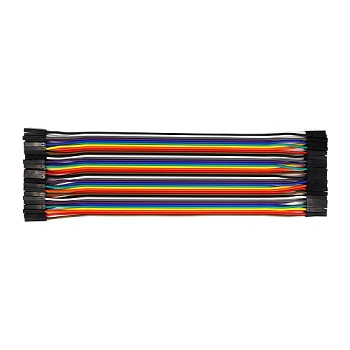
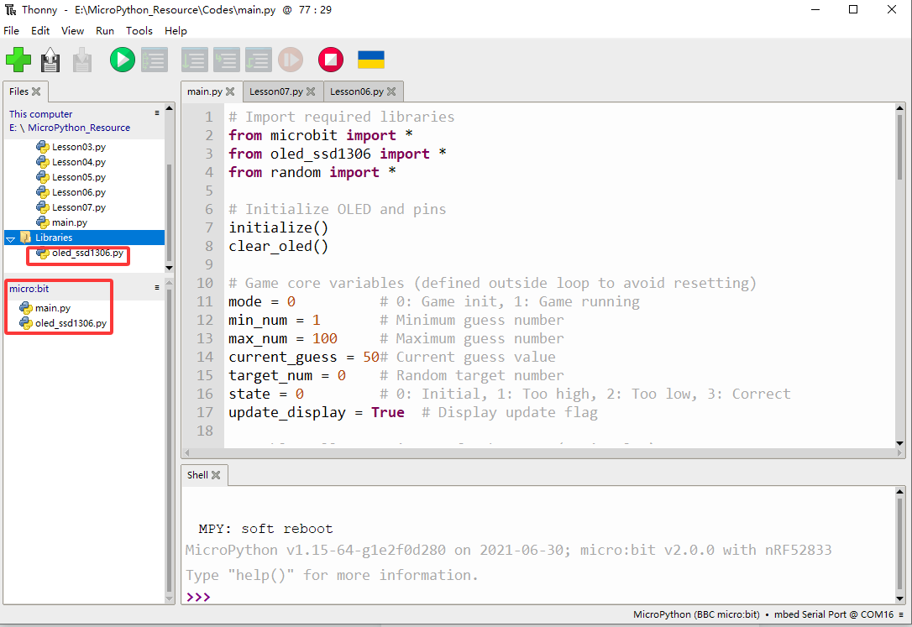

### 5.3.7 猜数字

#### 5.3.7.1 简介


在本项目教程中，将介绍如何使用Micro:bit主板、手柄控制板、OLED显示屏制作一个猜数字的游戏。当猜对了数字会在OLE显示D屏显示“Great!!!”，当猜的数字过大或者过小便会分别显示“To High!”或“To Low!”同时也会显示所猜数字的范围。


#### 5.3.7.2 所需组件

| |   | | 
| :--: | :--: | :--: |
| **micro:bit V2 主板**（自备） ×1 | **micro:bit智能手柄控制板**（已组装） ×1 |**AAA 电池** （自备）x4 |
|||
|**OLED显示屏** （自备）×1 |**母对母杜邦线**（自备） x4|

#### 5.3.7.3 接线图

⚠️ **特别注意：接线时，请注意区分线材颜色。**

| OLED显示屏 | micro:bit手柄控制板 |micro:bit主板引脚 |
| :--: | :--: | :--: | :--: |
| GND |  GND | GND |
| VCC |  3V | 3V |
| SDA |  SDA | P20 |
| SCL |  SCL | P19 |

#### 5.3.7.4 代码流程图


#### 5.3.7.5 实验代码

⚠️ **特别注意：在本课程中由于使用到了OLED，所以需要额外上传OLED的第三方驱动库**



**完整代码：**

```python
# Import required libraries
from microbit import *
from oled_ssd1306 import *
from random import *

# Initialize OLED and pins
initialize()
clear_oled()

# Game core variables (defined outside loop to avoid resetting)
mode = 0          # 0: Game init, 1: Game running
min_num = 1       # Minimum guess number
max_num = 100     # Maximum guess number
current_guess = 50# Current guess value
target_num = 0    # Random target number
state = 0         # 0: Initial, 1: Too high, 2: Too low, 3: Correct
update_display = True  # Display update flag

# Enable pull-up resistors for buttons (active low)
pin13.set_pull(pin13.PULL_UP)
pin15.set_pull(pin15.PULL_UP)
pin16.set_pull(pin16.PULL_UP)

while True:
    # 1. Game initialization: generate random number and reset state
    if mode == 0:
        min_num = 1
        max_num = 100
        current_guess = 50
        target_num = randint(min_num, max_num)  # Generate target number
        state = 0
        mode = 1  # Switch to running mode
        update_display = True

    # 2. Game running logic
    if mode == 1:
        # Check buttons (independent detection to avoid blocking)
        if pin15.read_digital() == 0:  # Pin15 pressed: increase number
            current_guess += 1
            if current_guess > max_num:
                current_guess = max_num
            update_display = True
            sleep(50)  # Debounce delay

        elif pin13.read_digital() == 0:  # Pin13 pressed: decrease number
            current_guess -= 1
            if current_guess < min_num:
                current_guess = min_num
            update_display = True
            sleep(50)  # Debounce delay

        elif pin16.read_digital() == 0:  # Pin16 pressed: confirm guess
            if current_guess > target_num:
                state = 1
                max_num = current_guess  # Narrow range: max = current
            elif current_guess < target_num:
                state = 2
                min_num = current_guess  # Narrow range: min = current
            else:
                state = 3  # Correct guess
                mode = 0   # Reset game
            update_display = True
            sleep(50)  # Debounce delay

        # 3. Update OLED display (only when needed)
        if update_display:
            clear_oled()  # Clear screen
            # Display number range
            add_text(0, 0, "num:" + str(min_num) + "~" + str(max_num))
            # Display current guess
            add_text(0, 2, str(current_guess))
            # Display status message
            if state == 1:
                add_text(0, 4, "TO High")
            elif state == 2:
                add_text(0, 4, "TO Low")
            elif state == 3:
                add_text(0, 4, "Great!!!")

            # Reset update flag
            update_display = False

    # 4. Delay after correct guess to show message
    if state == 3:
        sleep(1000)
        state = 0
```


**简单说明：**

① 导入库、初始化 OLED 屏幕、定义全局变量并配置按键引脚。
这段代码首先导入了三个必要的库：`microbit`（用于访问 Micro:bit 硬件），`oled_ssd1306`（用于控制连接的 OLED 显示屏），以及 `random`（用于生成游戏中的随机数字）。接着，它通过 `initialize()` 和 `clear_oled()` 函数对 OLED 屏幕进行初始化和清空，确保屏幕处于准备就绪的状态。然后，定义了一系列全局变量来管理游戏状态，包括游戏模式 (`mode`)、玩家猜测的数字范围 (`min_num`, `max_num`)、玩家当前的猜测值 (`current_guess`)、游戏的目标数字 (`target_num`)、游戏反馈状态 (`state`) 和一个用于控制屏幕更新的标志 (`update_display`)。最后，将用于玩家输入的 `pin13`、`pin15` 和 `pin16` 引脚配置为上拉模式，这意味着这些引脚在按键未按下时保持高电平，按下时则被拉低至低电平，便于检测按键操作。

```python
# Import required libraries
from microbit import *
from oled_ssd1306 import *
from random import *

# Initialize OLED and pins
initialize()
clear_oled()

# Game core variables (defined outside loop to avoid resetting)
mode = 0          # 0: Game init, 1: Game running
min_num = 1       # Minimum guess number
max_num = 100     # Maximum guess number
current_guess = 50# Current guess value
target_num = 0    # Random target number
state = 0         # 0: Initial, 1: Too high, 2: Too low, 3: Correct
update_display = True  # Display update flag

# Enable pull-up resistors for buttons (active low)
pin13.set_pull(pin13.PULL_UP)
pin15.set_pull(pin15.PULL_UP)
pin16.set_pull(pin16.PULL_UP)
```
② 主循环中的游戏初始化逻辑。
这段代码是程序主循环的第一个逻辑块，专门负责游戏的初始化或重新开始。当 `mode` 变量为 `0` 时，表示游戏需要进行初始化。此时，它会将猜测范围重置为 1 到 100，并将玩家的当前猜测值设为 50。最关键的是，它会使用 `randint(min_num, max_num)` 函数在 1 到 100 之间随机生成一个整数，作为玩家需要猜的目标数字 (`target_num`)。接着，将游戏状态 `state` 重置为 `0`（初始状态），并将 `mode` 切换到 `1`（运行模式），同时设置 `update_display` 标志为 `True`，以确保在进入游戏运行模式后，OLED 屏幕能够立即更新显示最新的游戏信息。

```python
while True:
    # 1. Game initialization: generate random number and reset state
    if mode == 0:
        min_num = 1
        max_num = 100
        current_guess = 50
        target_num = randint(min_num, max_num)  # Generate target number
        state = 0
        mode = 1  # Switch to running mode
        update_display = True
```
③ 主循环中的游戏运行逻辑：处理按键输入和猜测判断。
当游戏处于运行模式 (`mode == 1`) 时，这段代码负责处理玩家的交互和游戏逻辑。它会独立检测三个外部按键的输入：
*   **`pin15` 按下**: 如果 `pin15` 被按下（检测到低电平），玩家的 `current_guess` 会增加 1。为了防止数字超出范围，它会检查并限制 `current_guess` 不超过 `max_num`。
*   **`pin13` 按下**: 如果 `pin13` 被按下，玩家的 `current_guess` 会减少 1。同样，它会检查并限制 `current_guess` 不低于 `min_num`。
*   **`pin16` 按下**: 如果 `pin16` 被按下，表示玩家确认了当前的猜测值。程序会将其与 `target_num` 进行比较：
    *   如果 `current_guess` 大于 `target_num`，则 `state` 设为 `1`（表示“太高”），并将猜测范围的上限 `max_num` 更新为当前的 `current_guess`。
    *   如果 `current_guess` 小于 `target_num`，则 `state` 设为 `2`（表示“太低”），并将猜测范围的下限 `min_num` 更新为当前的 `current_guess`。
    *   如果 `current_guess` 等于 `target_num`，则 `state` 设为 `3`（表示“猜对了”），并将 `mode` 重置为 `0`，以便在下一轮循环中重新开始游戏。
在每次按键操作后，`update_display` 标志都会被设置为 `True`，以触发 OLED 屏幕的更新，并且程序会暂停 50 毫秒，以进行按键防抖处理，防止一次按键被多次识别。

```python
    # 2. Game running logic
    if mode == 1:
        # Check buttons (independent detection to avoid blocking)
        if pin15.read_digital() == 0:  # Pin15 pressed: increase number
            current_guess += 1
            if current_guess > max_num:
                current_guess = max_num
            update_display = True
            sleep(50)  # Debounce delay

        elif pin13.read_digital() == 0:  # Pin13 pressed: decrease number
            current_guess -= 1
            if current_guess < min_num:
                current_guess = min_num
            update_display = True
            sleep(50)  # Debounce delay

        elif pin16.read_digital() == 0:  # Pin16 pressed: confirm guess
            if current_guess > target_num:
                state = 1
                max_num = current_guess  # Narrow range: max = current
            elif current_guess < target_num:
                state = 2
                min_num = current_guess  # Narrow range: min = current
            else:
                state = 3  # Correct guess
                mode = 0   # Reset game
            update_display = True
            sleep(50)  # Debounce delay
```
④ 主循环中的 OLED 显示更新逻辑。
这段代码负责在 OLED 屏幕上显示游戏的当前状态和信息。它只在 `update_display` 标志为 `True` 时执行，以避免不必要的屏幕刷新，从而提高效率。每次执行时，它会首先调用 `clear_oled()` 清空屏幕上的所有内容。然后，在屏幕的第一行显示当前的猜测数字范围（例如 "num:1~100"）。在第三行显示玩家当前的猜测数字 (`current_guess`)。最后，根据 `state` 变量的值，在屏幕的第五行显示相应的提示信息：“TO High”（太高）、“TO Low”（太低）或“Great!!!”（猜对了）。完成所有显示内容的更新后，`update_display` 标志会被重置为 `False`，等待下一次游戏状态变化时再次触发更新。

```python
        # 3. Update OLED display (only when needed)
        if update_display:
            clear_oled()  # Clear screen
            # Display number range
            add_text(0, 0, "num:" + str(min_num) + "~" + str(max_num))
            # Display current guess
            add_text(0, 2, str(current_guess))
            # Display status message
            if state == 1:
                add_text(0, 4, "TO High")
            elif state == 2:
                add_text(0, 4, "TO Low")
            elif state == 3:
                add_text(0, 4, "Great!!!")

            # Reset update flag
            update_display = False
```
⑤ 主循环中处理正确猜测后的延时。
这段代码在玩家成功猜对数字 (`state == 3`) 后执行。它会使程序暂停 1000 毫秒（即 1 秒），给玩家足够的时间来看到屏幕上显示的“Great!!!”胜利消息。延时结束后，`state` 变量被重置为 `0`。由于在猜对时 `mode` 已经被重置为 `0`，在主循环的下一轮中，游戏将从初始化阶段重新开始。

```python
    # 4. Delay after correct guess to show message
    if state == 3:
        sleep(1000)
        state = 0
```

#### 5.3.7.6 实验结果


烧录程序后将micro:bit主板与组装好的手柄控制板连接（**需要安装电池**），将手柄控制板上的开关拨动到“ON”，将示例代码传成功下载到micro:bit主板后，OLED 显示屏初始化并显示数值范围 “num: 1 ~ 100” 和初始猜测值 50；玩家可通过按 C 键使当前猜测值 current_guess 加 1（上限为 100）、按 E 键使 current_guess 减 1（下限为 1），按键后屏幕会实时更新显示调整后的 current_guess 值；当按下 D 键提交猜测时，程序会将 current_guess 与随机生成的目标值 value 对比，若 current_guess 大于 value，屏幕提示 “To High!” 并更新最大值边界 max2 为当前 current_guess，若 current_guess 小于 value 则提示 “To Low!” 并更新最小值边界 min2 为当前 current_guess，若 current_guess 等于 value 则提示 “Great!!!”；猜对后屏幕保持 “Great!!!” 提示 1 秒，随后程序自动重置，生成新的随机目标值，回到初始状态开始新一轮猜数游戏，整个过程循环往复。


⚠️ **特别提醒：在实验结果中，动图中的积木块，是不提供的。**

<span style="color: rgb(0, 209, 0);">（**特别提示：** 如果未看到实验现象，请用手按下micro:bit主板上背面的复位按钮，）</span>


