## 5.2 Thonny 开发环境介绍

**在开始构建项目之前，你需要首先做一些准备，这是非常重要的，你不能跳过。**

### 5.2.1、安装Thonny(重要)：

Thonny是一个免费、开源的软件平台，体积小，界面简单，操作简单，功能丰富，是一个适合初学者的Python IDE。在本教程中，我们使用这个IDE在整个过程中开发Micro:bit。Thonny支持多种操作系统，包括Windows, Mac OS,  Linux。

**1.下载Thonny软件：**

**(1)进入软件官网**：https://thonny.org下载Thonny软件，最好下载最新版的，否则可能不支持Micro:bit.
**(2)Thonny的开源代码库**：https://github.com/thonny/thonny
请按照官网的指导安装或点击下面的链接下载安装。(请根据您的操作系统选择相应的选项.)

| 操作系统 | 下载链接/方法 |
| :-- | :-- | 
| MAC OS： | https://github.com/thonny/thonny/releases/download/v4.1.7/thonny-4.1.7.pkg| 
| Windows： | https://github.com/thonny/thonny/releases/download/v4.1.7/thonny-4.1.7.exe| 

| 系统 | 安装方式 | 命令/下载链接 |
| :-- |---------|--------------|
| Linux | Binary bundle | `bash <(wget -O - https://thonny.org/installer-for-linux)` |
|       | pip 安装 | `pip3 install thonny` |
|       | 发行版包管理 | Debian/Ubuntu：`sudo apt install thonny` Fedora：`sudo dnf install thonny` |
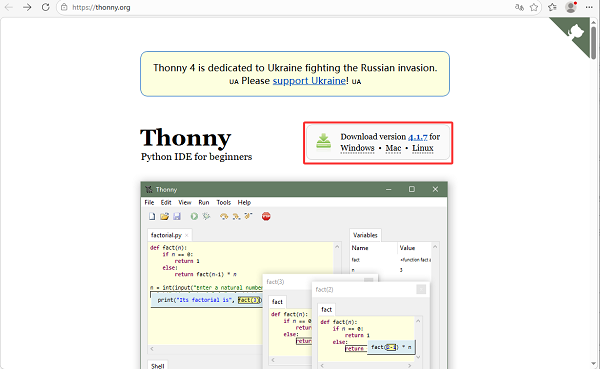

**2.Windows上安装Thonny软件：**
A.下载后的Thonny图标如下。

B.双击“thonny-4.1.7.exe”，会出现下面对话框，我这里是选择“”进行操作的。你也可以选择“”进行操作的。

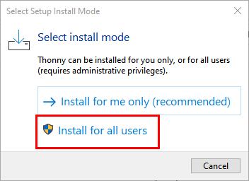

C.如果你不熟悉电脑软件安装，你可以一直单击“Next”直到安装完成。

D.如果您需要更改Thonny软件的安装路径，可以单击“Browse...”进行修改。选择安装路径后，单击“OK”。
如果您不想更改安装路径，只需单击“Next”；然后又继续单击“Next”。

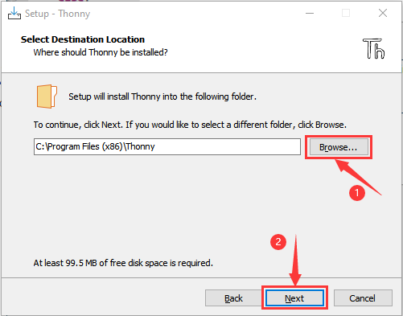

E.选中“Create desktop icon”，Thonny软件会在你的桌面上生成一个快捷方式，方便你稍后打开Thonny软件。

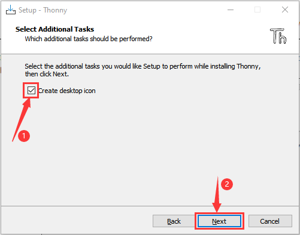

F.单击“Install”安装软件。

G.在安装过程中，您只需等待安装完成，千万不要点击“Cancel”，否则将无法安装成功。

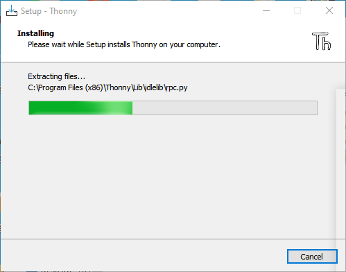

H.一旦看到如下界面，就表示已经成功安装了Thonny软件，点击“Finish”就可以。

I.如果你在安装过程中选择了“Create desktop icon”，则可以在桌面上看到如下图标。

                    

### 5.2.2 Thonny软件基本配置：

A.双击Thonny软件的桌面图标，可以看到如下界面，同时还可以进行语言选择和初始设置。设置完了点击“Let’s go！”。

B.选择“View”→“File”和“Shell”。

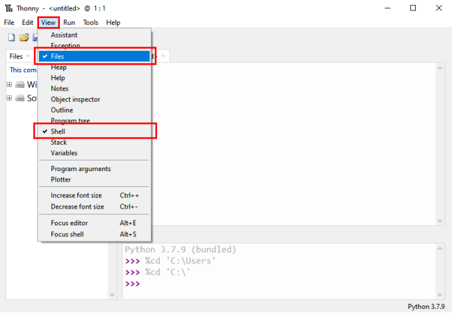

### 5.2.3 烧入Micropython固件(重要)

要在Micro:bit主板上运行Python程序，我们需要先将固件烧入到Micro:bit主板。

**烧入Micropython固件**
用USB线连接计算机和Micro:bit主板。  

确保驱动程序已成功安装，并能正确识别COM端口。打开设备管理器并展开“Ports”。

注：不同人的COM端口可能不同，这是正常情况。
1. 打开Thonny，点击“Run” ，选择 “Configure interpreter...”

3.在interpreter中选中“Micropython (BBC micro:bit)”，选中“mbeb Serial Port @ COM16”，然后点击“Install or update firmware”。

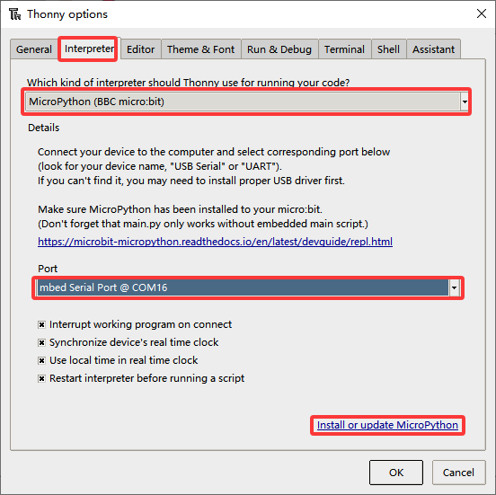

4.弹出如下对话框，“Target volume”选择“MICROBIT”，“MicroPython family”选择“nRF52”，“variant”选择“BBC micro:bit v2 (original simplifiled API)”,“version”选择“2.1.2”,然后点击“Install”，等待安装完成提示。（注意：如果安装固件失败，请单击Micro:bit主板上的reset按键，再次点击“Install”。）

5.等待安装完成。安装完成后先点击“Close”再点击“OK”就行。

6.关闭所有对话框，转到主界面，点击“STOP”。如下图所示

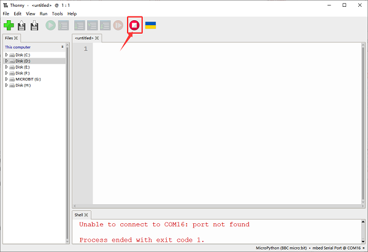

7.到目前为止，一切准备工作都已就绪。
### 5.2.4 如何上传文件

**在线运行(重要性)**

Micro:bit需要连接到计算机时，它是在线运行。用户可以使用Thonny编写和调试程序。
1. 打开Tonny并单击“Open”。

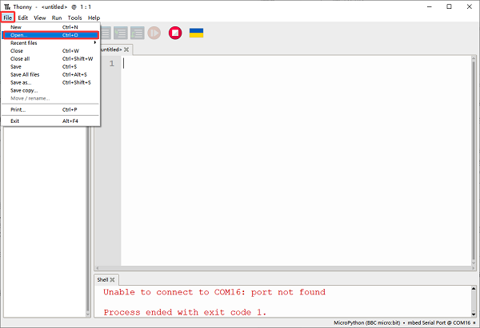

2.在新弹出的窗口中，打开".\MicroPython_Resource\Codes\Heart beat"路径下的“heartbeat&ZeroWidthSpace;.py”
单击“Run current script”（如果产生报错请单击  ，再单击“Run current script”在线运行代码），将会观察到Micro:bit上出现爱心闪烁的效果。

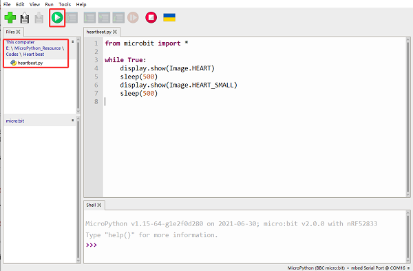

注意：在线运行时，如果按下Micro:bit的复位键，用户的代码将不会再次执行。如果你希望在重置代码后自动运行该代码，请参考下面的离线运行。

**离线运行(重要性)**

Micro:bit复位后，首先运行根目录下的main.py文件。因此，为了让Micro:bit在重置后执行用户程序，我们上传到Micro:bit的文件名称改为main.py,然后进行文件的上传，然后按下复位键便可以实现代码效果。这里我们以程序heartbeat.py为例。选中**heartbeat&ZeroWidthSpace;.py**,单击右键选择"**rename**",再单击"**OK**"，然后再右键单击以选择“**Upload to micro:bit**”进行代码上传。

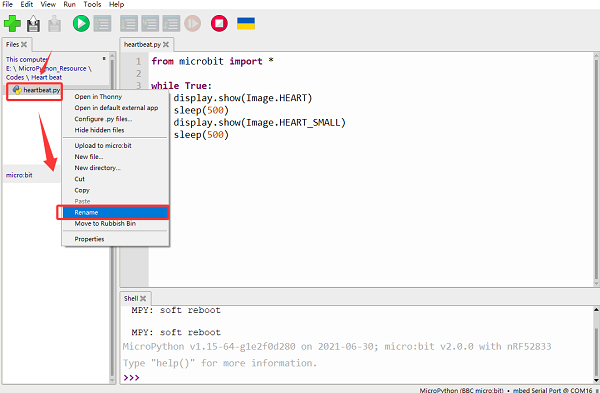

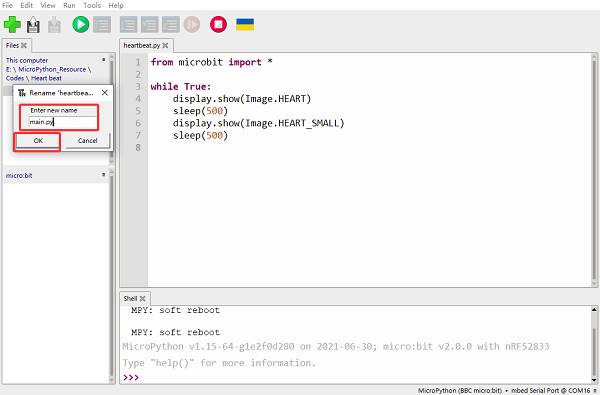

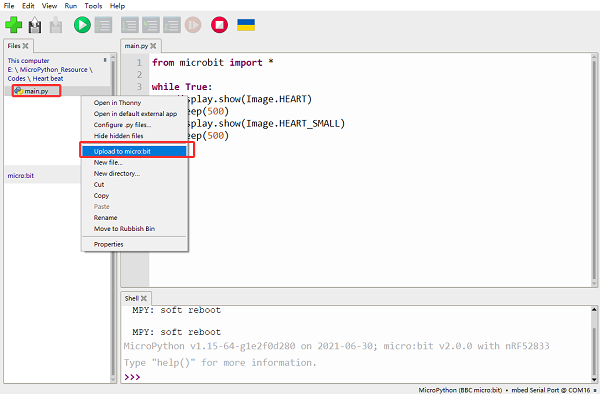

3.按下Micro:bit的Reset键，将会观察到Micro:bit上出现爱心闪烁的效果。

4.如果需要上传其它代码（不包括库文件），首先需要将代码文件名改为main&ZeroWidthSpace;.py,然后再进行上传；如果是需要上传库文件，直接单击右键选择“Upload to micro:bit”进行代码上传（如果您的库文件过大，可能会出现上传失败的情况，这个时候需要将您的程序精选精简优化或删除没有使用到的库文件）。

### 5.2.5 Thonny常见的操作：

**删除Micro:bit根目录下的文件**

在“micro:bit”中选择“main&ZeroWidthSpace;.py”，右键单击它且选择“Delete”，将“main&ZeroWidthSpace;.py”从Micro:bit的根目录中删除。

要删除其它文件也是一样的操作。

            