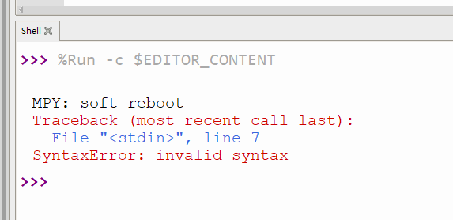
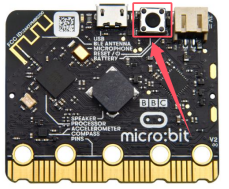

## 故障排除

1\. 上传代码后 micro:bit 板载5*5点阵显示哭脸，然后滚动显示错误信息。

2\. 如果是上传的代码时是否有不小心增加或者删除了代码中的字符，可以根据shell窗口的提示进行检查。

3\. 如果上传的代码是带有第三方库文件的，那就先检查是否有给micro:bit主板上传相应库文件，请参考 “**5.2.4 如何上传文件**” 进行导入库文件。

4\. 上传代码后点击不显示打印的数据，需要按下Micro:bit主板上背面的复位按键。

5\. 如果当您烧录了Makecode代码后，开发板内的micropython固件将会丢失，将会在shell窗口中提示如下错误

此时只需要重新烧录固件即可，可参考烧入**5.2.3 Micropython固件(重要)**

