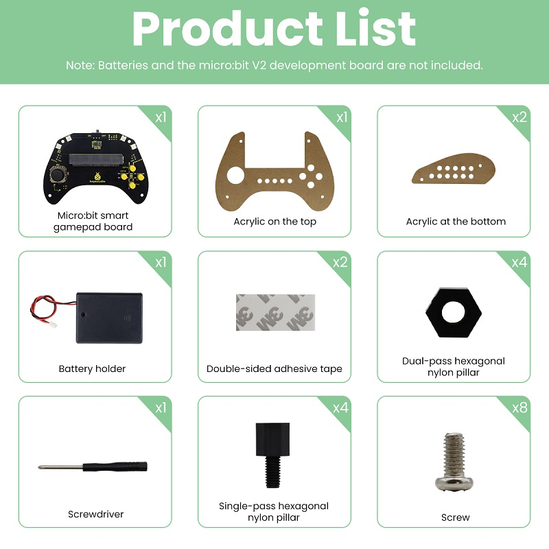
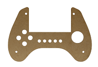
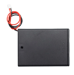
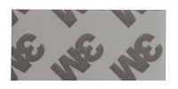
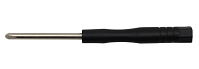
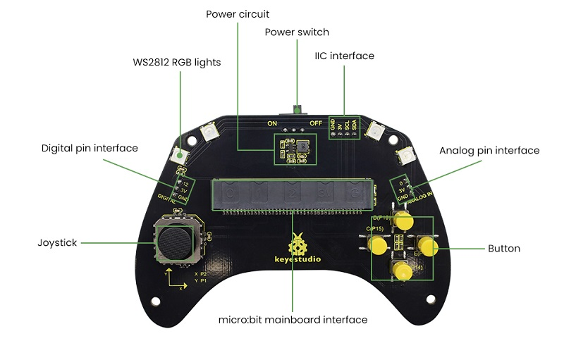
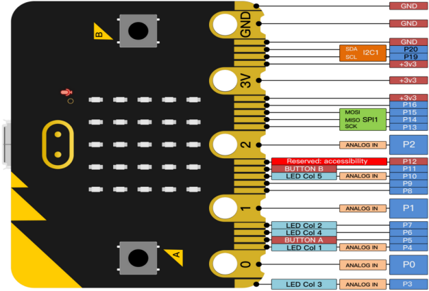

# 1. 产品介绍

## 1.1 产品安全 

1. 本产品含细小零件，请避免儿童独自接触。

2. 请严格按照教程操作，避免产品损坏，注意用电安全。

## 1.2 产品简介

这是一款基于Micro:bit主板的智能手柄套件，通过集成多种电子元器件，搭建各种好玩有趣的DIY小项目，并且可用来控制各种基于Micro:bit主板的小车及机器人，为用户提供直观生动的学习体验。该套件不仅能让学生和初学者在实践操作中领略科技创新的乐趣，更能有效培养其逻辑思维能力，同时充分展现科技应用的实用价值与教育意义。

## 1.3 产品清单

如果发现有缺失的配件，请立即联系我们的销售人员。

| 序号 | 规格 | 数量| 图片 |
| :--: | :--: | :--: | :--: |
| 1 | micro:bit 手柄控制板 | 1 | |
| 2 |手柄顶部亚克力板| 1 | |
| 3 |手柄底部亚克力板| 2 ||
| 4 | 电池盒 | 1 | |
| 5 | 20mm*40mm双面胶| 2 | |
| 6 |  M3*8mm 黑色双通尼龙柱| 4 | |
| 7 | 十字螺丝刀| 1 | |
| 7 | M3*6+5mm 黑色单通尼龙柱| 4 | |
| 8 | M3*6mm 圆头螺钉| 8 | |

## 1.4 产品参数

- 工作电压：DC 3.3V

- 电池电压：DC 6V

- 最大输出电流：≤2A
   
- 最大耗散功率：≤10W

- 工作温度：–10℃至+65℃

- 产品重量：（增加包装后的重量）

- 包装尺寸：186mm×90mm×46mm(±1%)

## 1.5 手柄控制板介绍

### 1.5.1 简介

在教育市场，micro:bit控制板以其小巧和易用性，在编程和创客教育中广受欢迎。然而，单个micro:bit控制板在游戏控制或小车机器人操控等应用中，往往缺乏直观、便捷的交互方式。我们特别设计了这款keyestudio手柄控制板，用于micro:bit控制板。

手柄控制板充分利用micro:bit控制板的IO口，集成了摇杆、按键等常用游戏输入模块，并通过3PIN接口(GND, VCC, Signal)或直接连接的方式，方便地与micro:bit控制板进行数据交互。

此外，它还将一些常用的串行通信接口扩展为引脚间距为2.54mm的排针接口，例如I2C和模拟/数字引脚。因此，这个手柄控制板可以使micro:bit控制板在游戏或机器人项目中，轻松与外部显示屏、无线模块等其他通信设备进行连接。

您可以通过手柄控制板上的电池盒接口安装4颗AAA电池为整个手柄系统供电，同时也能为micro:bit控制板供电。

⚠️ **特别注意:**

当手柄控制板上的摇杆、按键或连接的外部传感器模块工作时，如果您所安装的电池电量不足，可能导致整个系统无法正常工作。

### 1.5.2 特点

- 输入电压：电池盒接口(DC 4~6V) 或 micro USB接口(DC 5V)
- 输出电压：DC 3.3V
- 自带电源指示灯
- 模拟引脚（P0）
- I2C通信引脚
- 数字引脚（P12）
- 外形尺寸: 66mm x 58mm x 12mm
- 重量: 31 g

### 1.5.3 引脚分配

## 1.6 Micro:bit快速掌握

### 1.6.1 Micro:bit是什么？

micro:bit 是一款由英国广播电视公司（BBC）推出的专为青少年编程教育设计的微型电脑开发板。

micro:bit主板只有信用卡一半大小，但功能非常强大。micro:bit V2.0主板拥有丰富的板资源，搭载了5×5可编程LED点阵、2颗可编程按键、加速度计、电子罗盘、温度计、可触摸感应的Logo、MEMS麦克风、低功耗蓝牙等电子模块，背面还有一个蜂鸣器，可以在没有外部设备的情况下也可以播放各种声音。此外，micro:bit主板还支持休眠模式，用户可以长按micro:bit主板后面的复位&电源按钮，使进入睡眠模式，降低电池功耗。

### 1.6.2 Micro:bit V2主板硬件介绍

### 1.6.3 Micro:bit V2引脚配置介绍

Micro:bit引出的引脚中，其引脚功能分类如下表所示：

| 功能 | 引脚 |
| :--: | :--: | 
| GPIO | P0，P1，P2，P3，P4，P5，P6，P7，P8，P9，P10，P11，P12，P13，P14，P15，P16，P19，P20 |
| ADC/DAC | P0，P1，P2，P3，P4，P10 |
| IIC | P19（SCL），P20（SDA）|
| SPI | P13（SCK），P14（MISO），P15（MOSI） |
| PWM（常用） |P0，P1，P2，P3，P4，P10|
|已占用|P5(Button A)，P4(LED Col1)，P3(LED Col3)，P6(LED Col4)，P7(LED Col2)，P10(LED Col5)，P11(Button B)|

详细信息请参考官方网站：

- [https://tech.microbit.org/hardware/edgeconnector/](https://tech.microbit.org/hardware/edgeconnector/)

- [https://microbit.org/](https://microbit.org/)

- [https://microbit.org/get-started/features/overview/](https://microbit.org/get-started/features/overview/)

- [https://microbit.org/guide/hardware/pins/](https://microbit.org/guide/hardware/pins/)

- [https://microbit.org/projects/make-it-code-it/](https://microbit.org/projects/make-it-code-it/)

- [https://microbit.org/get-started/what-is-the-microbit/](https://microbit.org/get-started/what-is-the-microbit/)

### 1.6.4 Micro:bit V2主板注意事项

1. Micro:bit主板上有很多精密的电子元件，建议戴上硅胶保护套进行使用，防止短路。

2. Micro:bit主板的IO口驱动能力很弱，IO口电流不足300mA，请勿接大电流器件（例如大舵机MG995、直流电机），否则会烧坏micro:bit主板，使用前必须完全了解清楚你所使用的器件电流情况，一般建议配搭micro:bit扩展板进行使用。

3. 供电建议从Micro:bit主板的USB口进行供电，或者micro:bit主板上的3V电池座接口。Micro:bit主板本身IO口是3V3电平，所以是不支持5V传感器的，如需支持5V传感器需要使用 Micro:bit扩展板。

4. 使用与Micro:bit主板上5×5LED点阵屏的共用引脚（如P3、P4、P6、P7、P10），记得在代码中把5×5LED点阵屏禁用掉，否则会有5×5LED点阵屏乱亮的现象。

5. **不要使用P19、P20 IO 口，P19和P20是不能当做IO口来使用的，** 虽然makecode编辑器上显示可以使用，实际是用不了的！只能用于I2C通信。

6. 3V电池座接口上不能使用超过3.3V电池，插上去很容易会把micro:bit主板烧坏。

7. 禁止放在金属制品上使用，以免发生短路。

**总之：** micro:bit主板就像是一台微型计算机，它使编程变得有形，并促进数字创造力。
