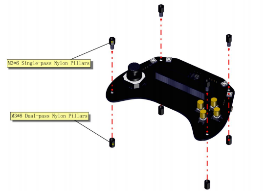
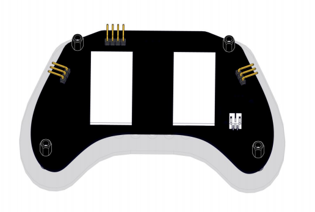
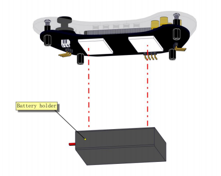
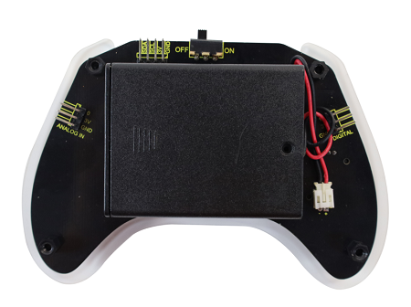
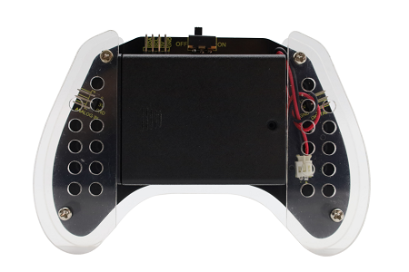

# 3. 智能手柄组装

## 3.1 智能手柄组装介绍
在拿到本产品时先找到以下零件

先找到控制板和单通与双通的尼龙柱，将其安装在控制板上；

此步骤安装完成后

找到顶部亚克力与4颗M3*6的螺钉，将顶部亚克力与控制板进行组装

此步骤安装完成后

找到3M双面胶将胶纸贴在控制板背面两侧处（黄色框线内）

此步骤安装完成后

找到电池盒，将电池盒上面的开关拨到"ON",有开关那一面朝向胶纸进行粘贴，并将开关电源线与控制板进行连接

此步骤完成安装后

找到底部两块亚克力与4颗M3*6的螺钉，将其进行组装

此步骤安装完成后，本产品完成安装

